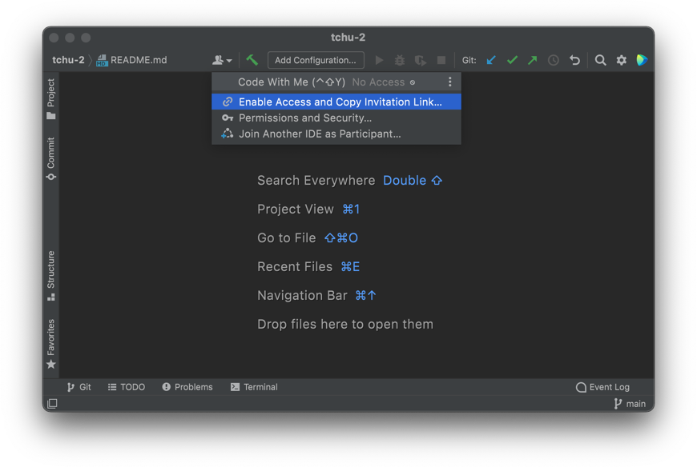
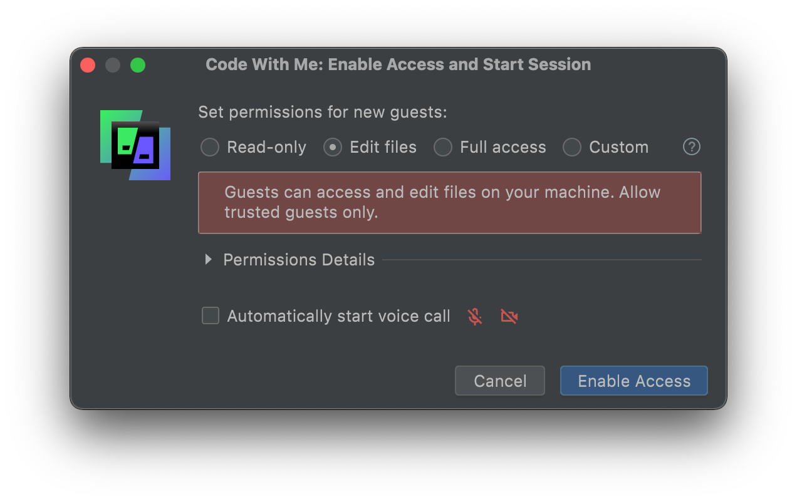
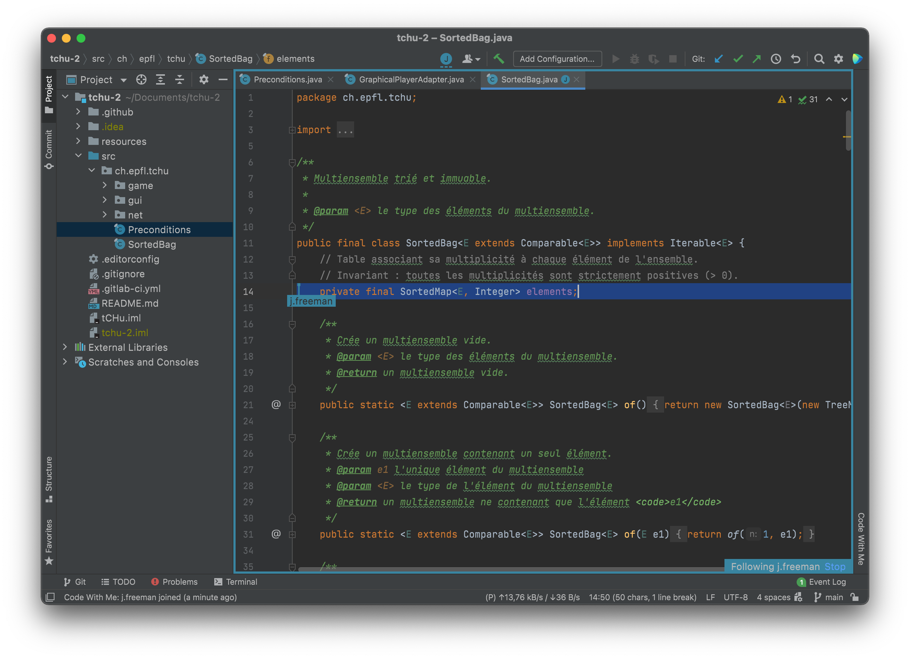

# Utiliser Code With Me
{: .no_toc }

Nous allons voir maintenant un autre outil pour le travail en groupe. **Code With Me** est une fonctionnalité d’IntelliJ IDEA qui te permet de partager ton éditeur avec quelqu’un d’autre.

Contrairement à Git qui est prévu pour la collaboration sur le long terme, Code With Me fonctionne en temps réel. Par exemple, tu vois en direct la position dans le code et le texte sélectionné par tes partenaires, de la même manière que dans Google Docs. C’est très pratique pour faire du *pair programming*, c’est-à-dire travailler à plusieurs en même temps sur le même code.

## Table des matières
{: .no_toc.text-delta }
1. TOC
{:toc}

## Établir la connexion
Code With Me est inclus par défaut dans IntelliJ IDEA, tu n’as rien de spécial à installer !

Tu trouveras le **menu Code With Me** dans la barre du haut d’IntelliJ IDEA. Tu l’ouvres en cliquant sur l’icône en forme de silhouettes dans la partie droite.

Depuis l’ordinateur sur lequel le projet est ouvert, clique sur le menu puis sélectionne **Enable Access and Copy Invitation Link…**.

Tu peux paramétrer précisément les permissions que tu donnes aux personnes qui rejoindront la session. Nous te recommandons d’utiliser le niveau de permission *Edit files* qui est le plus approprié la plupart du temps. Ensuite, clique sur **Enable Access**. Un lien d’accès à la session est alors automatiquement copié.

Depuis l’autre ordinateur, sélectionne **Join Another IDE as Participant…** dans le menu Code With Me et colle le lien. Après quelque temps, ton projet s’ouvre chez l’autre personne ! Elle peut alors se balader dans les fichiers et les modifier.

Tu peux voir en temps réel ce que fait ton binôme. Si tu sélectionnes son icône dans la barre du haut (à gauche du menu *Code With Me*), IntelliJ IDEA va automatiquement faire défiler le code pour aller au même endroit, et ce tant que l’icône est sélectionnée.

## Créer des sessions à durée illimitée
Par défaut, les sessions Code With Me sont limitées à une demi-heure. Mais en tant qu’étudiant-e, tu peux obtenir une licence gratuite qui te permet de faire des sessions d’une durée limitée.

* Rends-toi sur <a href="https://www.jetbrains.com/shop/eform/students" target="_blank">jetbrains.com/shop/eform/students</a>.
* Sélectionne **University email address** et remplis le formulaire en utilisant ton adresse e-mail <em>@epfl.ch</em>.

  <header>Astuce</header>
  
Si tu possèdes le <a href="https://education.github.com/pack" target="_blank"><em>GitHub Student Developer Pack</em></a>, tu peux utiliser à la place ton compte GitHub pour prouver ton statut. Ce pack est un ensemble d’offres gratuites utiles pour les études en informatique, n’hésite pas à aller jeter un œil à l’occasion !

* Tu recevras ensuite un e-mail de confirmation. Clique sur le lien qu’il contient, puis crée un compte JetBrains quand on te le propose.
* Dans IntelliJ IDEA, rends-toi dans le menu Code With Me, puis clique sur **« ⋮ »** dans l’entête du menu. Sélectionne **Manage License**, et connecte-toi avec ton compte JetBrains.

Note que le compte JetBrains que tu auras ainsi créé te permet également d’utiliser gratuitement tous les éditeurs de code que JetBrains propose !
