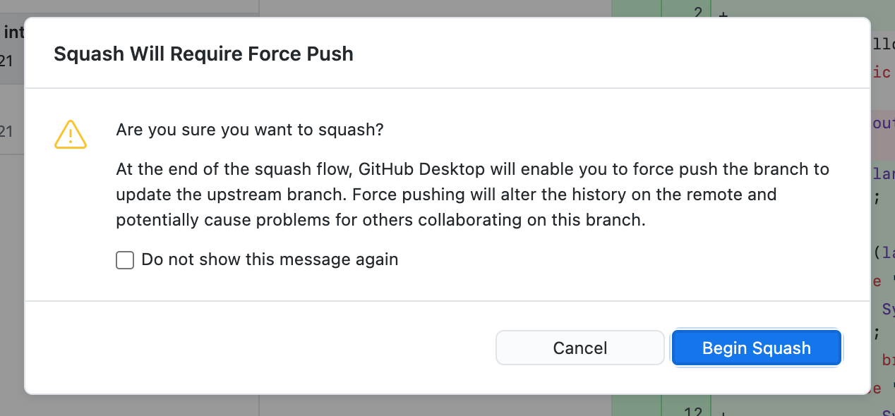
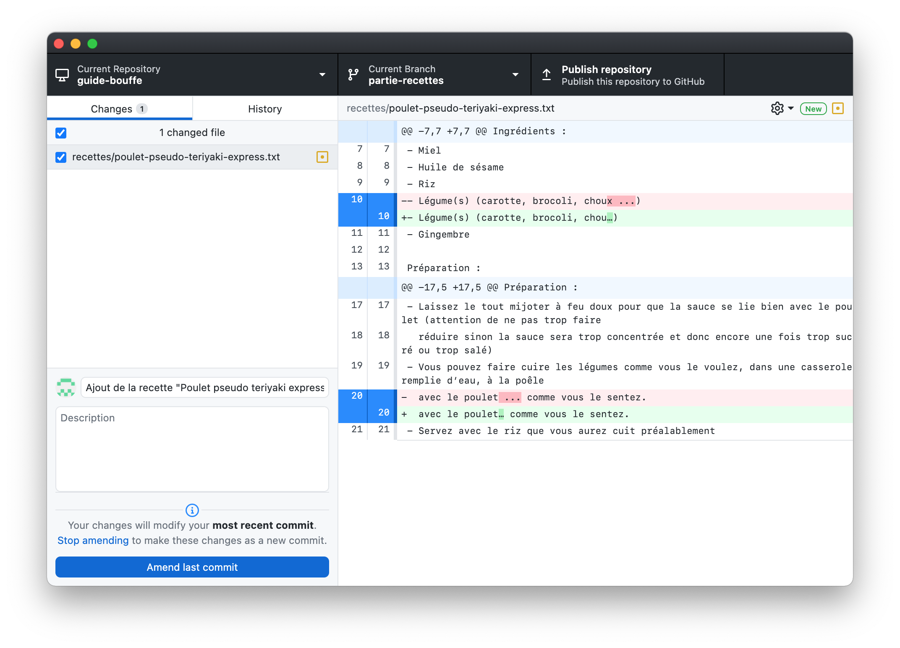
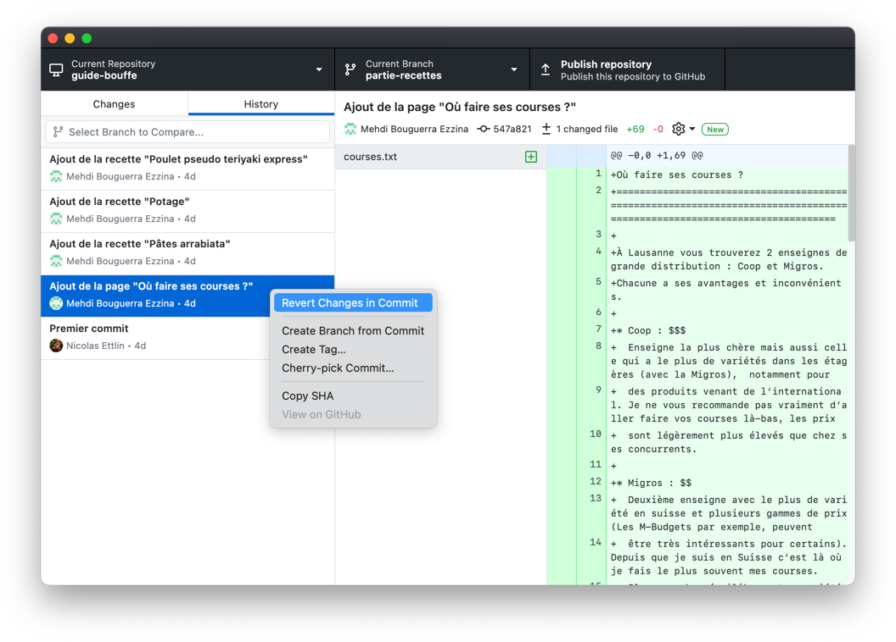

# Manipuler l’historique
{: .no_toc }

Dans cette partie, nous allons voir plusieurs méthodes pour modifier des commits qui ont déjà été effectués.

Mais à quoi cela pourrait-il bien être utile ? L’intérêt principal est de pouvoir nettoyer l’historique des commits avant de le [*push*](../collaboration/sync#push-envoyer-ses-modifications) vers le dépôt distant. Par exemple, si tu fais une erreur au moment de créer ton commit, cela ne sert à rien de créer un autre si cela alourdit inutilement l’historique.

  <header>Avertissement</header>
  

    De manière générale, il ne <strong>faut pas</strong> modifier un commit que tu as déjà <a href="../collaboration/sync#push-envoyer-ses-modifications"><em>push</em></a>. En effet, cela causera des problèmes si une autre personne a déjà récupéré en local les commits initiaux.
  

  

    GitHub Desktop est assez malin et te protège de cette situation. Certaines actions ne sont pas disponibles lorsque tu as déjà <em>push</em> les commits en questions. Pour d’autres, GitHub Desktop t’affichera un avertissement avant de le faire :
  

  
  

    Si tu es conscient-e des dangers et que tu le fais quand même, le bouton <em>push</em> sera remplacé par un bouton <strong>force push</strong>. Celui-ci remplacera la branche distante par ta branche locale, supprimant au passage les anciens commits de la branche distante.
  

  

## Table des matières
{: .no_toc.text-delta }
1. TOC
{:toc}

## Modifications du dernier commit

### Annuler le dernier commit
En bas à gauche de la fenêtre de GitHub Desktop, un bouton te permet d’annuler le dernier commit effectué. L’interface est remise dans l’état dans laquelle elle était juste avant que le commit ait été créé.

Note que cette action n’est pas directement disponible sur Git (si tu l’utilises en ligne de commande), c’est juste une simplification offerte par GitHub Desktop.

<video controls autoplay loop muted playsinline src="../assets/undo.mp4"></video>

### Amender le dernier commit
Cette fonctionnalité permet d’**ajouter les modifications en cours au dernier commit** (au lieu de les mettre dans un nouveau). Tu peux aussi l’utiliser pour **modifier le titre** du dernier commit effectué.

Pour commencer, rends-toi dans l’historique des commits. Fais un clic droit sur le dernier commit, puis sélectionne *Amend Commit…*.

L’interface de création de commit est alors remplacée par celle qui permet d’amender. Tu peux alors cocher les modifications à inclure dans le dernier commit, et éventuellement modifier son titre ou sa description. Une fois que tu as terminé, confirme avec le bouton *Amend last commit*.

## Modifications de l’historique

### Réordonner des commits
Depuis l’historique des commits, tu peux glisser-déposer un commit entre deux autres pour **modifier leur ordre**.

<video controls autoplay loop muted playsinline src="../assets/reorder.mp4"></video>

### Fusionner (*squash*) des commits
Depuis l’historique, tu peux glisser-déposer un ou plusieurs commits par dessus un autre. Cela aura pour action de **fusionner tous les commits en un nouveau**. Dans la fenêtre qui s’ouvre, tu peux choisir le nom et la description du nouveau commit.

<video controls autoplay loop muted playsinline src="../assets/squash.mp4"></video>

## *Revert* un commit
Enfin, cette opération peut être utile pour **annuler un commit déjà push**. Le *revert* va créer un nouveau commit faisant l’exact opposé de ce commit. Pour le faire, fais un clic droit sur un commit dans l’historique, puis clique sur *Revert Changes in Commit*.

