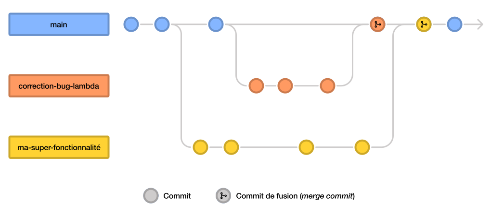

# Utiliser les branches
Dans cette partie, tu vas découvrir une fonctionnalité très pratique de Git : les **branches**.

Les branches sont un mécanisme qui permet de séparer un projet en **plusieurs versions distinctes** qui peuvent évoluer chacune séparément. À tout moment, tu peux décider de **fusionner** deux branches, ce qui consiste à effectuer sur une branche les changements faits sur une autre.

## Un exemple
Pour l’instant, tout cela peut te sembler très abstrait, alors voici un exemple de comment tu peux utiliser les branches lorsque tu développes un logiciel.

Lorsque tu as [initialisé le dépôt](../git-intro/init), tu t’es retrouvé sur sa **branche principale** qui est nommée dans la plupart des projets *main* ou *master*[^1]. Cette branche contiendra la version la plus stable de ton logiciel, où toutes les fonctionnalités sont achevées (donc la version que tu distribueras aux personnes qui utilisent ton programme).

Maintenant, disons que tu veux développer une nouvelle fonctionnalité. Tu crées donc une **nouvelle branche** portant le nom de ta fonctionnalité, disons *ma-super-fonctionnalité*. Selon son ampleur, il faudra peut-être plusieurs commits pour la finaliser, que tu effectueras tous sur cette branche.

Pendant ce temps, les autres branches pourront évoluer librement chacune de leur côté (ce qui sera très pratique si tu travailles à plusieurs !). Une fois ton travail achevé, tu pourras fusionner la branche *ma-super-fonctionnalité* dans la branche principale, pour que toutes les modifications que tu as faites s’y retrouvent. Cela fonctionne même si d’autres modifications ont été faites entre temps sur la branche principale !

[^1]: Le nom utilisé par défaut pour la branche principal a longtemps été *master*. Ce nom est actuellement en train d’être remplacé par *main* pour éviter la terminologie liée à l’esclavagisme (*maître*/*esclave*) dont il était issu. Les nouveaux dépôts créés sur GitHub ou avec GitHub Desktop <a href="https://github.com/github/renaming" target="_blank">utilisent désormais *main*</a>, et un changement similaire est en train d’être effectué <a href="https://lore.kernel.org/git/xmqqa6vf437i.fsf@gitster.c.googlers.com/T/#t" target="_blank">dans Git lui-même</a>.

