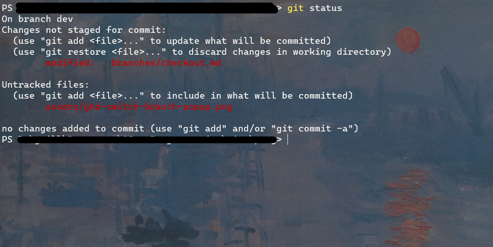

# Changer de branche

Une autre importante fonctionnalité et la capacité de changer de branche. Dans l'exemple abordé [ici](../branches/#un-autre-exemple) il nous faut passer d'une branche `feature-05` à la branche `master`. Ceci est une action qui est **important de maitrisé** car très souvent utilisé !

* [Depuis GitHub-Desktop](#changer-de-branche-sur-github-desktop)
* [Depuis le Terminal](#changer-de-branche-sur-le-terminal)

# Changer de branche sur GitHub Desktop
Sur GitHub Desktop il suffit de trouver le boutons `Branche actuelle` et sélectionner la branche sur laquelle on veux se mettre. Notez que si des modifications sont actuellement en cours, il vous serra demandez si vous voulez
* "*Laisser les modifications sur la* &lt;branche-actuelle&gt;"
* "*Amenez les modifications sur la* &lt;branche-cible&gt;"


# Changer de branche sur le Terminal

Pour changer de branche **si vous n'avez aucune modification** (que toutes vos modifications ont été `commit`)
```sh
    git checkout <nom-de-la-branch-cible>
```

Si vous avez des modifications que vous souhaitez ammener dans la nouvelle branche
```sh
    git add -A
    git stash
    git checkout <nom-de-la-branch-cible>
    git stash pop
```

* La commande `git add -A` marque simplement toutes les modifications comme "*prêtes à être commises*"
* Le `git stash` à pour but d'enregistrer les modifications ailleurs et de revenir au point ou était la branche avant les modifications (depuis le dernier `commit`)
* Le `git checkout` change la branche courrante
* Enfin le `git stash pop` prends les modifications que l'on a préhalablement mis de côté et les reproduits sur la branches courrante !

<div class="note indent">
  <header>Note</header>
  <p>
    La commande <code>git status</code> est un outil pratique pour connaitre l'état des changements que l'on à écrits
    
  </p>
</div>