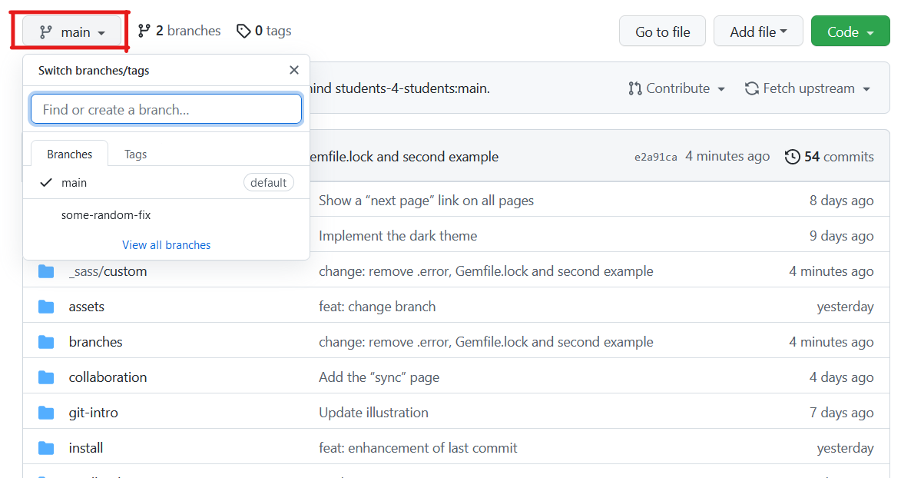

# Changer de branche

Une autre importante fonctionnalité et la capacité de changer de branche. Dans l'exemple abordé [ici](../branches/#un-autre-exemple) il nous faut passer d'une branche `feature-05` à la branche `master`. Ceci est une action qui est **important de maitrisé** car très souvent utilisé !

* [Depuis GitHub-Desktop](#changer-de-branche-sur-github-desktop)
* [Depuis GitHub](#changer-de-branche-sur-github)

# Changer de branche sur GitHub Desktop
Sur GitHub Desktop il suffit de trouver le boutons `Branche actuelle` et sélectionner la branche sur laquelle on veux se mettre. Notez que si des modifications sont actuellement en cours, il vous serra demandez si vous voulez
* "*Laisser les modifications sur la* &lt;branche-actuelle&gt;"
* "*Amenez les modifications sur la* &lt;branche-cible&gt;"

# Changer de branche sur Github
Sur GitHub tu peux aussi visualiser d'autre branche que la `master` en selectionnant la branche cible

