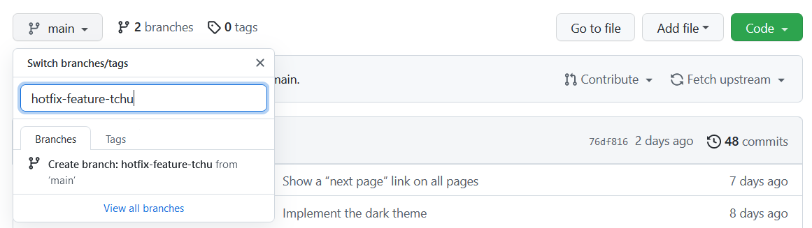

# Créer une nouvelle branche

Dans cette partie nous allons découvrir comment creer une nouvelle branche. Pour ce faire nous vous montrerons trois méthodes différentes (Github-Desktop, GitHub, et grâce au bon vieux terminal)
* [Depuis GitHub-Desktop](#créer-une-branche-grâce-à-github-desktop)
* [Depuis GitHub](#créer-une-branche-grâce-à-github)

## Créer une branche grâce à Github Desktop

Une fois **Github Desktop** installé et le dépôt initialisé vous pouvez créer une nouvelle branche. Pour ce faire simplement cliquez sur le bouton correspondant. Une fenêtre s'ouvrira alors demandant le nom de cette branche. Par exemple `hotfix-feature-tchu`.

Bravo !! Vous venez de créer une *branche locale*. Etant locale elle n'apparaitra donc pas sur GitHub (elle est lier au *dépôt locale*). 
Pour pallier a ce problème vous pouvez donc simplement cliquez sur le bouton `Publiez branche` et celle si sera automatiquement mise en ligne.

## Créer une branche grâce à Github

Connectez-vous à [github](https://github.com/login) puis sélectionné le dépôt d'intérêt. Cette technique permettra de créer une branche directement à *l'origin* (à l'inverse de locale). Appuyez sur le bouton pour selectionner votre branch et entrez dans la zone de texte le nom de votre nouvelle branche. Appuyez sur entrer une fois finit, et voilà !

  <header>Note</header>
  

    Grâce à cette technique la branche et directement créer à <i>l'origin</i>. Néanmoins elle n'apparaitra immédiatement localement. En effet pour celà il faut mettre à jour le dépot soit en appuyant sur le bouton <b>Fetch Origin</b>, sur <i>GitHub Desktop</i> soit via la commande <code>git fetch</code>
  

