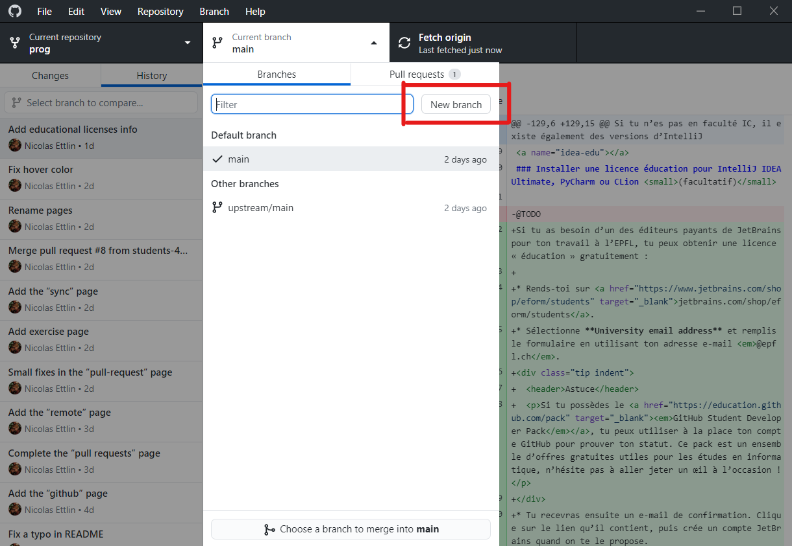
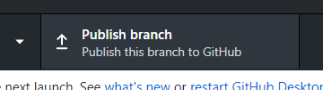
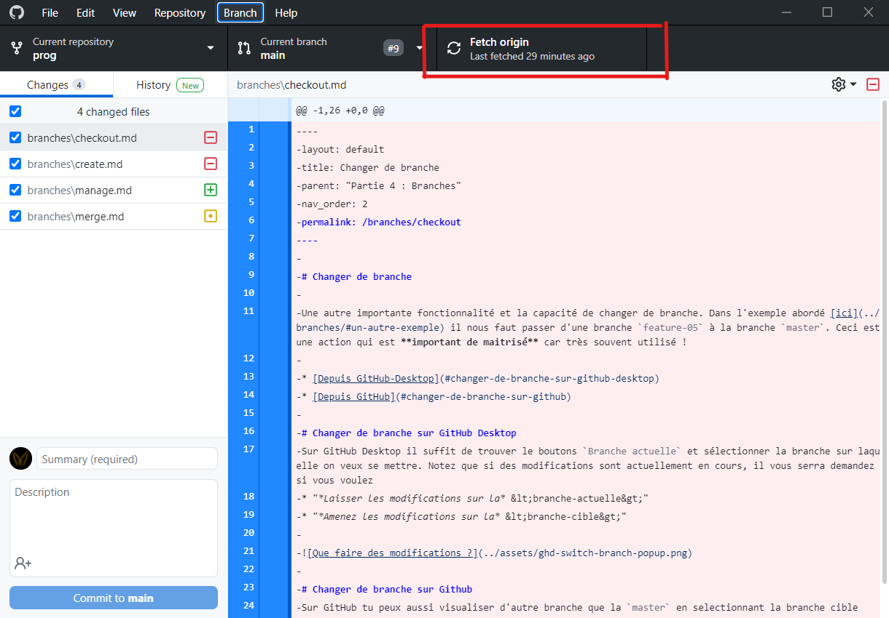
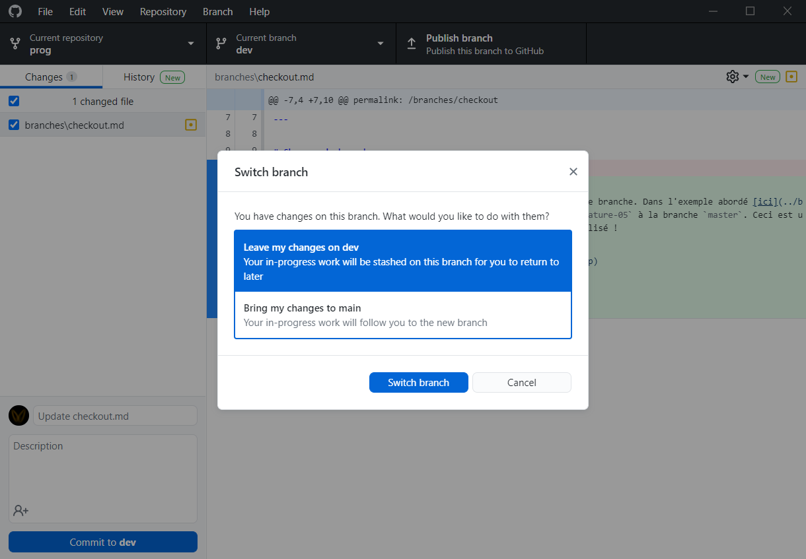

# Gérer ses branches

Comme discuté dans la partie précédente les branches sont des outils qui rendent git aussi incontournable. Dans cette section tu vas découvrir comment créer ces branches, et changer la branche courrante 

## Créer une branche grâce à Github Desktop

Une fois **Github Desktop** installé et le dépôt initialisé vous pouvez créer une nouvelle branche. Pour ce faire simplement cliquez sur le bouton correspondant. Une fenêtre s'ouvrira alors demandant le nom de cette branche. Par exemple `hotfix-feature-tchu`.

Bravo !! Vous venez de créer une *branche locale*. Etant locale elle n'apparaitra donc pas sur GitHub (elle est lier au *dépôt locale*). 
Pour pallier a ce problème vous pouvez donc simplement cliquez sur le bouton `Publiez branche` et celle si sera automatiquement mise en ligne.

## Changer la branche courante sur GitHub Desktop
Sur GitHub Desktop il suffit de trouver le boutons `Current branch` et sélectionner la branche sur laquelle on veux se mettre.

  <header>Note</header>
  

    Si certaines branches ne s'affichent pas dans les branches disponible mais qui apparaissent dans les branches sur GitHub alors vous devez mettre-à-jour le dépôt en cliquant sur le bouton <code>Fetch origin</code>
    
  

Notez que si des modifications sont actuellement en cours, il vous serra demandez si vous voulez
* "*Laisser les modifications sur la* &lt;branche-actuelle&gt;" auquelle cas les modifications qui n'aurons pas été *commisent* resterons sur la branche actuelle
* "*Amenez les modifications sur la* &lt;branche-cible&gt;" auquelle cas les modifications qui n'aurons pas été *commisent* serons exporté sur la nouvelle branche

