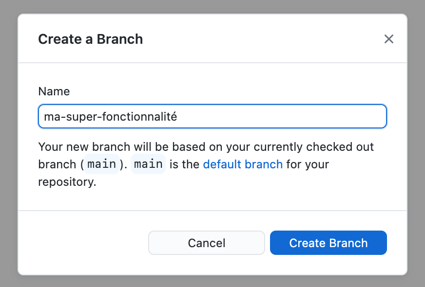
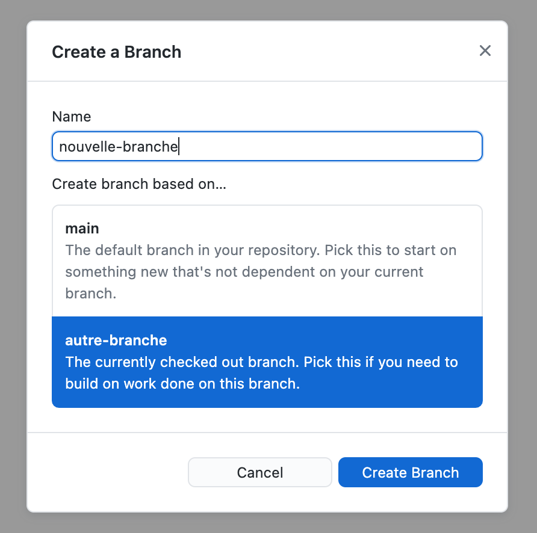
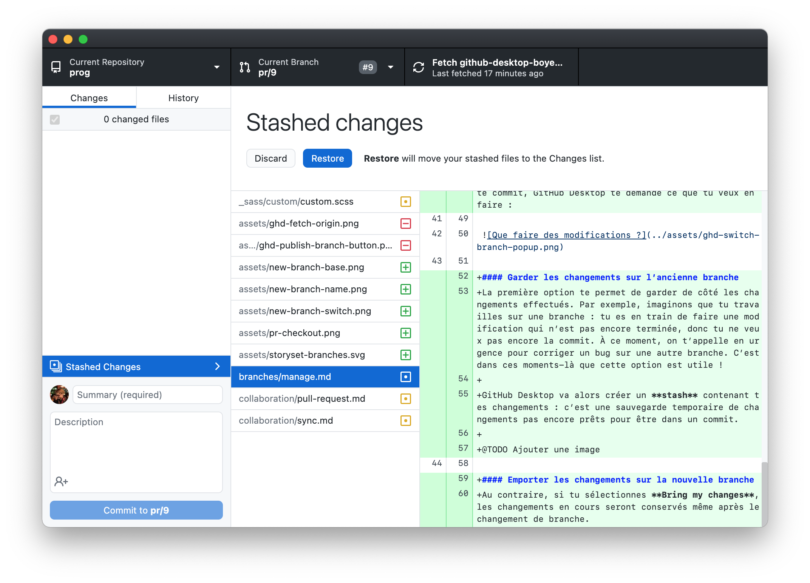

# Gérer ses branches
{: .no_toc }

Comme discuté dans la partie précédente, les branches sont des outils qui rendent Git incontournable. Dans cette section, tu vas découvrir comment créer ces branches et changer la branche courante.

<figure>
  
  <figcaption>Illustration par <a href="https://storyset.com" target="_blank">Storyset</a>.</figcaption>
</figure>

## Table des matières
{: .no_toc.text-delta }
1. TOC
{:toc}

## Créer une branche

Pour créer une nouvelle branche, ouvre d’abord le **sélecteur de branches** en cliquant sur **Current branch** dans la barre du haut. L’encadré qui s’ouvre t’affiche toutes les branches de ton projet. Clique alors sur **new branch**.

Une fenêtre s'ouvrira alors demandant le nom de cette branche :

Et voilà ! L’entête de GitHub Desktop affiche désormais *Current Branch: {ta-nouvelle-branche}*.

  <header>Choisir la branche de base</header>
  
Lorsque tu crées une nouvelle branche, celle-ci part avec le même historique de commits que sa branche de base. Si tu pars d’une autre branche que la branche principale, GitHub Desktop te permet de choisir la branche principale ou la branche actuelle comme branche de base.

  

## Changer la branche courante sur GitHub Desktop
Pour choisir une autre branche comme branche active, il te suffit de cliquer dessus dans le sélecteur de branches.

### Emporter des modifications en cours
Si tu changes de branches, ou en crées une nouvelle, alors que tu as des modifications qui n’ont pas encore été commit, GitHub Desktop te demande ce que tu veux en faire :

#### Garder les changements sur l’ancienne branche (stash)
La première option te permet de garder de côté les changements effectués. Par exemple, imaginons que tu travailles sur une branche : tu es en train de faire une modification qui n’est pas encore terminée, donc tu ne veux pas encore la commit. À ce moment, on t’appelle en urgence pour corriger un bug sur une autre branche. C’est dans ces moments-là que cette option est utile !

GitHub Desktop va alors créer un **stash** contenant tes changements : c’est une sauvegarde temporaire de changements pas encore prêts pour être dans un commit.

Quand tu seras de retour sur la branche de départ, tu verras un lien **Stashed Changes** en bas à gauche. En cliquant dessus, tu pourras voir les changements qu’il contient. Tu peux cliquer pour **Restore** pour les restorer, ou sur *Discard* pour les supprimer définitivement.

#### Emporter les changements sur la nouvelle branche
Au contraire, si tu sélectionnes **Bring my changes**, les changements en cours seront conservés même après le changement de branche.
