# Fusionner des branches
{: .no_toc }

Maintenant, nous allons voir l’aspect le plus puissant des branches : la possibilité d’en fusionner une dans une autre.

C’est aussi injustement la partie la plus redoutée de Git, car la gestion des conflits dans une fusion en aura effrayé plus d’un. Un conflit est une situation où les mêmes lignes de code ont été modifiées indépendamment dans les deux branches. Git ne sait alors pas comment réconcillier ces deux chagements opposés, et te demande alors quoi faire. Mais pas besoin de t’inquiéter, une fois que tu auras compris comment faire, tu trouveras cet outil très pratique !

## Table des matières
{: .no_toc.text-delta }
1. TOC
{:toc}

## Notre situation
C’est ton jour de chance ! Tu as rencontré un distributeur qui a entendu parler de [ton incroyable programme *Hello World*](../intellij-idea/run). Enthousiasmé par ce projet « révolutionnaire » qui « va bouleverser les esprits », il aimerait t’aider à le commercialiser aux quatre coins du monde. Mais il y a un hic : pour ce logiciel puisse être utilisé dans tous les pays, il faut qu’il soit traduit en plusieurs langues.

Comme tu t’es bien rappelé de tes cours Students 4 Students, tu as créé une branche `feature-multilingue` dans laquelle tu as développé cette nouvelle fonctionnalité[^1] :

[^1]: Ce code utilise des notions que tu n’as pas encore vues. Tu n’as pas besoin de comprendre comment il fonctionne en détail !

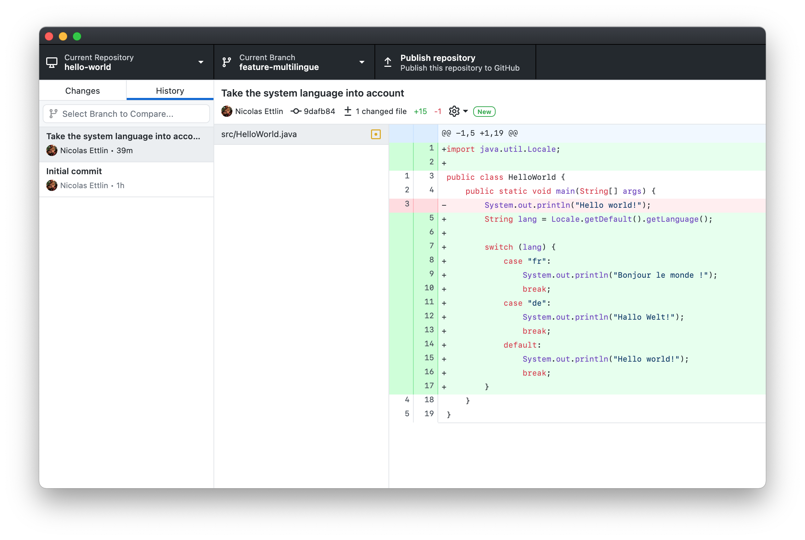

Maintenant, tu aimerais intégrer ces changements dans la branche `main`, qui contient la version stable du logiciel. Nous allons donc **fusionner** la branche `feature-multilingue` (que nous allons appeler ici **branche source**) dans la branche `main` (la **branche cible**).

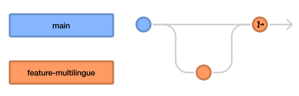

  <header>Note</header>
  
Tu n’as ici pas besoin d’effectuer les étapes pas-à-pas. Un exercice à la fin du chapitre te permettra de pratiquer ces notions.

## Effectuer une fusion
Tout d’abord, il faut commencer par [changer de branche](manage) pour te rendre dans la branche cible (ici `main`).

Clique ensuite sur le sélecteur de branches (*Current Branch*), puis clique sur le bouton **Choose a branch to merge into main**.

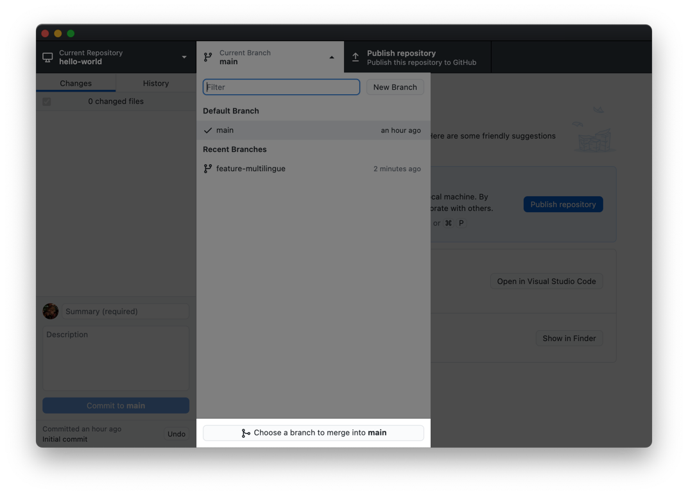

Sélectionne ensuite la branche source. Dans cette situation simple, il n’y a pas de conflits : tu peux cliquer sur **Create a merge commit**, et la fusion s’effectue directement : le message *“Successfully merged feature-multilingue into main”* s’affiche.

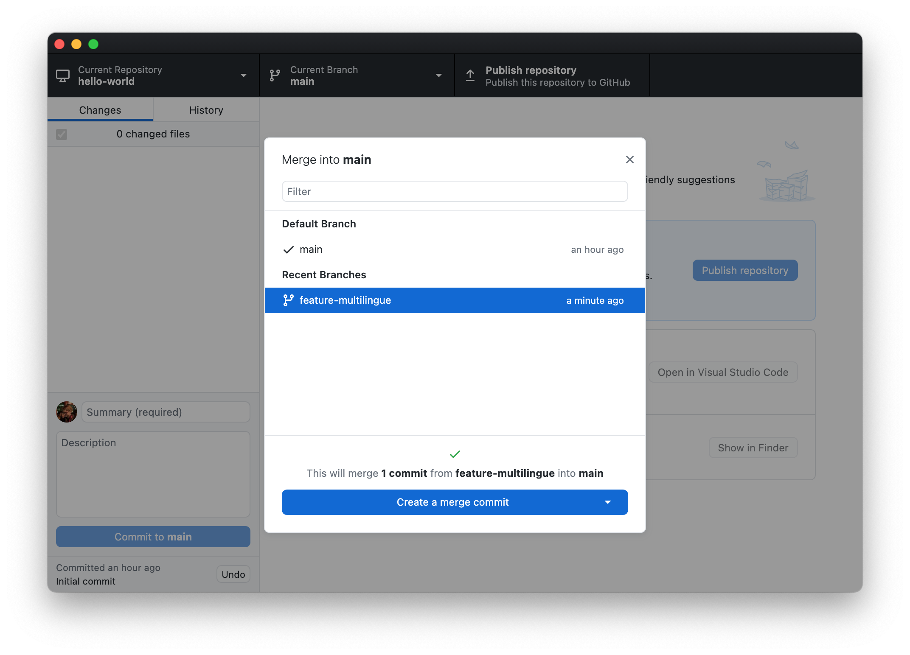

## Gérer les conflits

### Introduction
Maintenant, comment pouvons-nous procéder si les mêmes lignes de code ont subit des modifications différentes dans les deux branches ?

Par exemple, imaginons que tu aimerais ajouter des traductions du programme *Hello World* dans deux nouvelles langues. Ce sont deux modifications différentes, que tu effectues sur deux nouvelles branches, `add-italian` et `add-russian` :

<figure>
  
  <figcaption>Modifications sur la branche <code>add-italian</code>.</figcaption>
</figure>
<figure>
  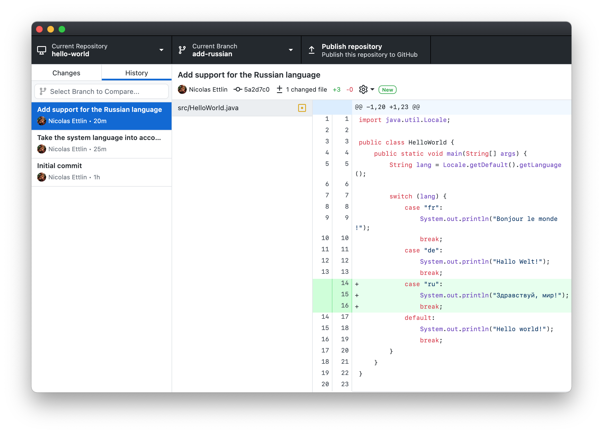
  <figcaption>Modifications sur la branche <code>add-russian</code>.</figcaption>
</figure>

Comme tu peux le voir, les deux modifications sont faites au même endroit. Git ne peut donc pas deviner ce que doit être le résultat final ! Tu vas donc gérer un conflit manuellement.

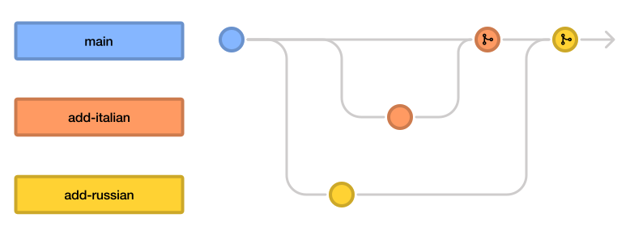

### Pour démarrer…
Commençons par fusionner la branche `add-italian`. Tu peux le faire sans problème, car il n’y a pas encore de conflit. Par contre, lorsque tu fusionnes `add-russian`, GitHub Desktop t’avertit qu’il y a un conflit :

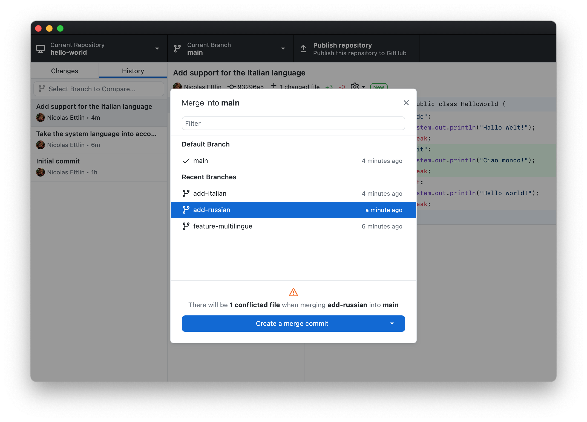

Clique sur **Create a merge commit**. Ensuite, une nouvelle fenêtre t’affiche les fichiers concernés :

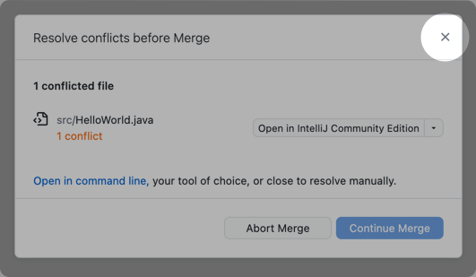

Nous allons utiliser un outil d’IntelliJ IDEA qui te permet de résoudre les *merge conflicts*. Tu peux donc **fermer** la fenêtre *Resolve conflicts before Merge* en **cliquant sur la croix**[^2].

[^2]: Tu peux ignorer les boutons *Open* dans la liste des fichiers : la façon dont la fonctionnalité *Resolve Conflicts* d’IntelliJ IDEA marche les rend inutiles.

### Résoudre les conflits dans IntelliJ IDEA
Ouvre maintenant ton projet dans IntelliJ IDEA. Dans la [recherche globale](../intellij-idea/ui#recherche-globale), cherche **Resolve conflicts…**.

IntelliJ IDEA affiche la liste des fichiers où il y a des conflits. Avec les boutons *Accept Yours* et *Accept Theirs*, tu peux choisir d’utiliser la version d’une branche spécifique. Dans notre cas, ce n’est pas ce qu’on veut faire, car les modifications apportées des deux côtés nous intéressent. Clique donc sur le bouton **Merge…**.

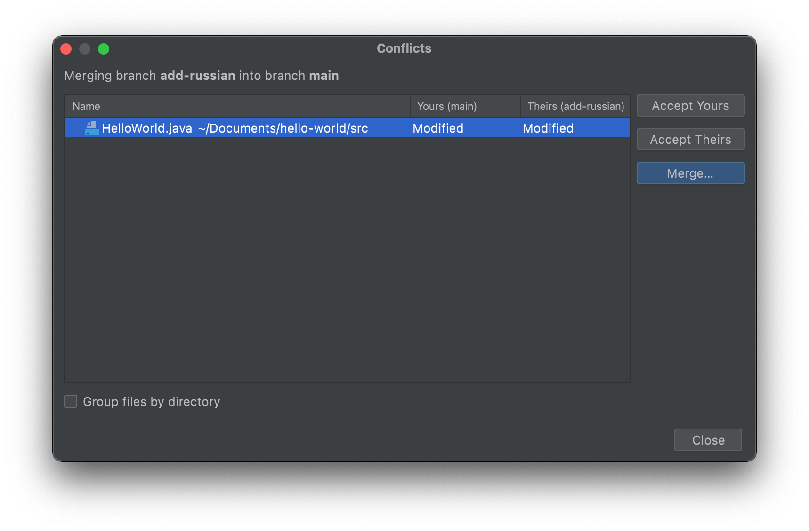

La fenêtre qui s’ouvre alors te permet de comparer les modifications effectués. Les deux branches que tu fusionnes s’affichent sur les côtés,
et au milieu s’affiche le résultat final. Pour chaque modification, tu peux appuyer soit sur
&nbsp;**Accept** pour insérer cette modification dans le résultat,
ou sur &nbsp;**Ignore** pour l’ignorer.

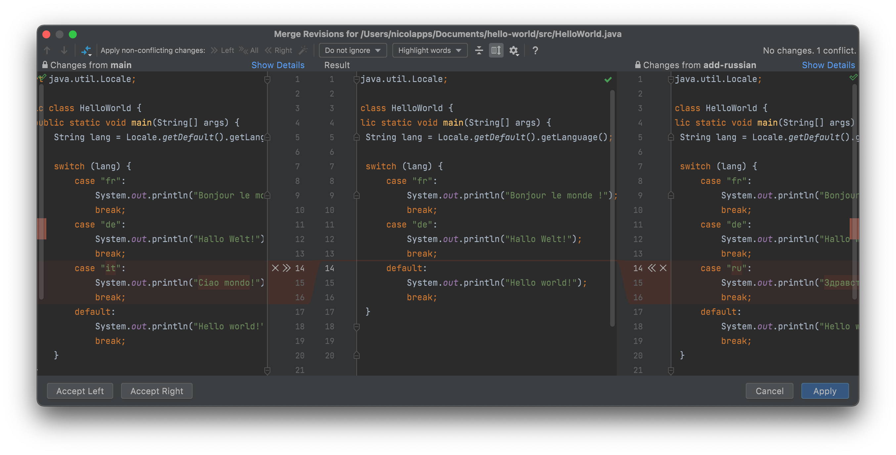

Une fois que tu as fini de traiter un fichier, clique sur le bouton **Apply** en bas de la fenêtre.
Répète ces instructions jusqu’à ce que tu aies traité tous les fichiers avec conflits.

### Finaliser
Une fois que tu as fini de traiter tous les conflits, retourne dans GitHub Desktop. Les modifications apportées par le *merge* s’affichent alors comme lorsque tu crées un commit. Clique sur le bouton **Commit to main** pour effectuer la fusion.

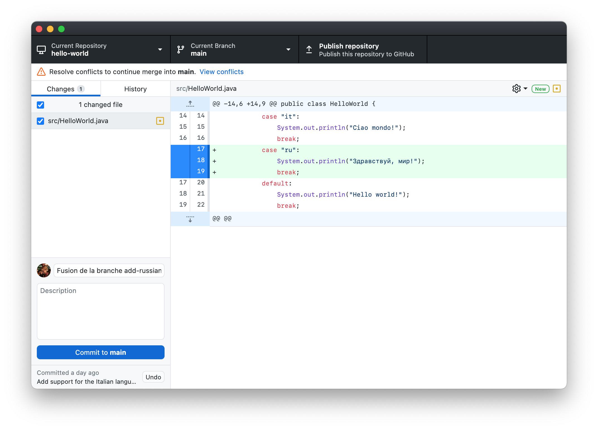

  <header>Note</header>
  

  Les commits qui finalisent une fusion sont appelés <strong>commits de fusion</strong> (ou en anglais <strong>merge commits</strong>). Ils sont très similaires aux commits standards, à une exception : un <em>merge commit</em> a plusieurs commits parents, au lieu d’un seul.
  

  
Lorsque tu fusionnes des branches sans qu’il n’y ait de conflit, GitHub Desktop crée un commit de fusion automatiquement.

## Notes de bas de page
