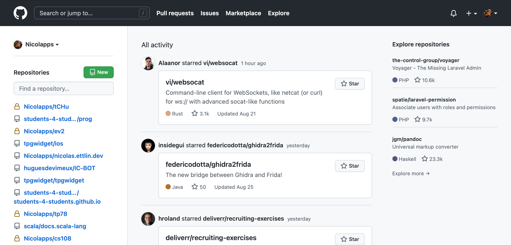
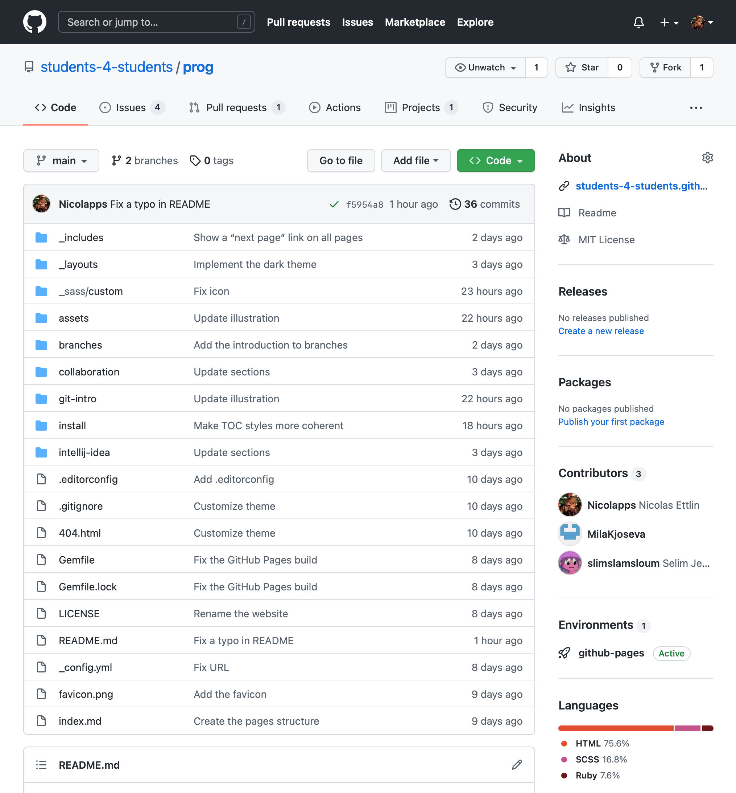

# Découverte de GitHub
{: .no_toc }

Dans cette partie, nous allons jeter rapidement un œil aux fonctionnalités les plus importantes de GitHub.

## Table des matières
{: .no_toc.text-delta }
1. TOC
{:toc}

## Page d’accueil
Il s’agit de la page qui s’affiche lorsque tu te connectes avec ton compte sur <a href="https://github.com" target="_blank">github.com</a>. Sur la gauche, tu retrouves la liste des dépôts sur lesquels tu travailles.

En haut à droite, tu retrouves trois menus essentiels :

* les **notifications**, où tu retrouveras les dernières modifications importants des dépôts que tu suis ;
* le **menu *Nouveau***, qui te permet entre autres de créer un nouveau dépôt ;
* et le **menu *Profil***, qui te permet d’accéder à ton profil et tes réglages.

## Page de dépôt
Rends-toi maintenant sur une page de dépôt. Si tu n’en a pas une sous la main actuellement, tu peux utiliser le <a href="https://github.com/students-4-students/prog" target="_blank">dépôt qui contient ce site</a>.

En haut de la page se trouvent plusieurs onglets contenant des fonctionnalités du dépôt, dont les *pull requests* dont nous parlerons [plus tard](pull-request).

Plus bas, tu retrouves les fichiers stockés dans le dépôt. Par défaut, c’est la branche principale qui s’affiche, mais tu peux voir le contenu d’une autre branche avec le sélecteur en haut à gauche.

### Créer un *fork*
Le bouton ***Fork*** en haut à droite pourra t’être utile si tu veux contribuer à des projets dans lesquels tu n’as pas les droits de modification. Il crée une copie du dépôt (appelée *fork*) sur ton propre compte, sur laquelle tu auras tout les droits.
