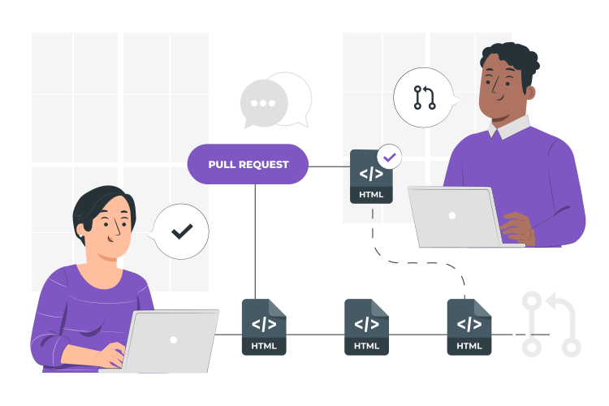
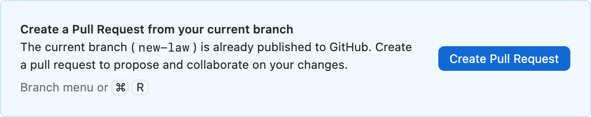
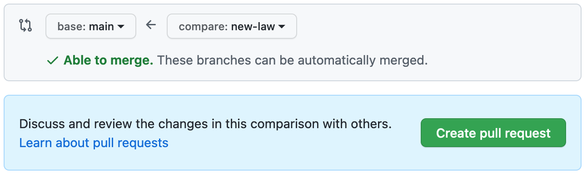
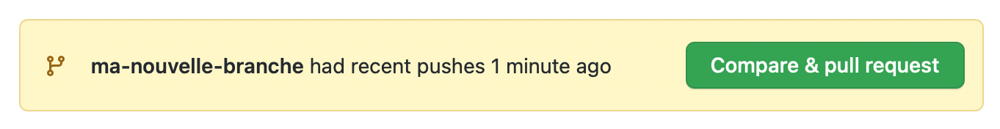
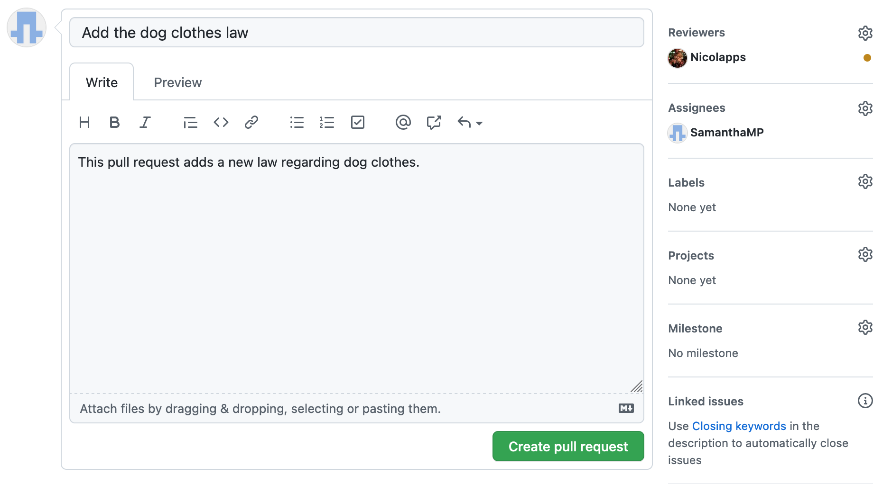
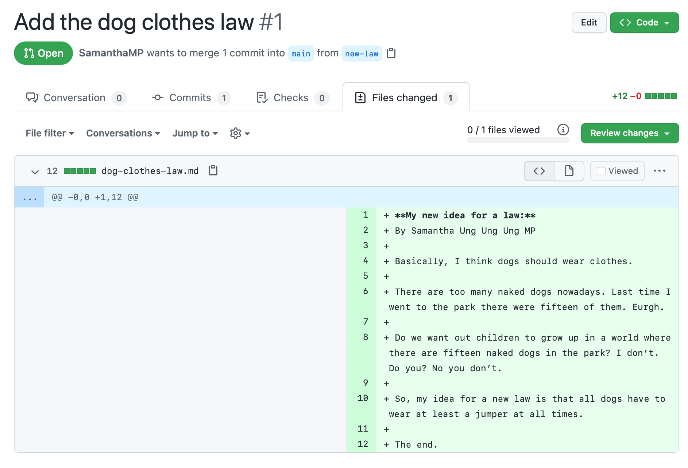
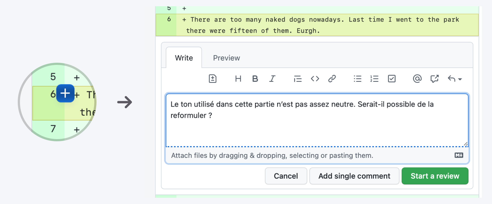
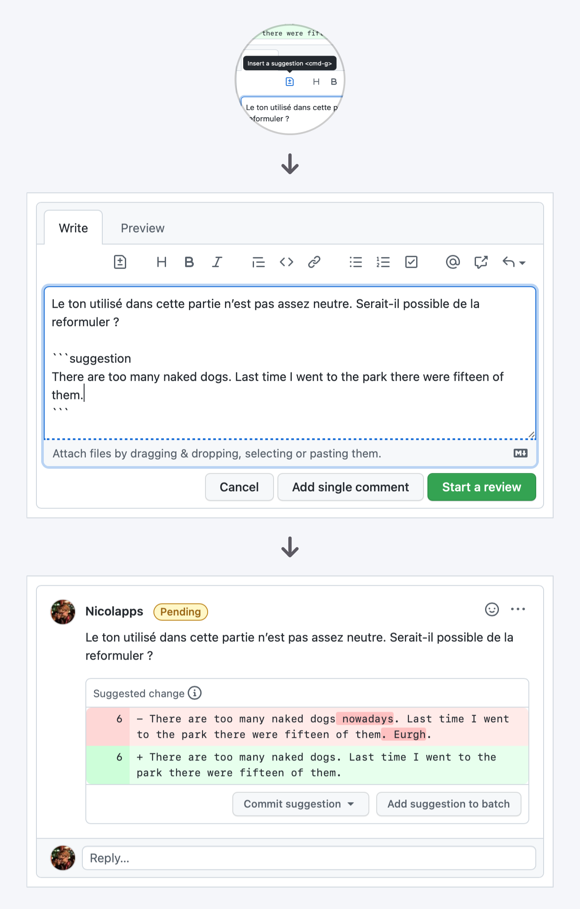
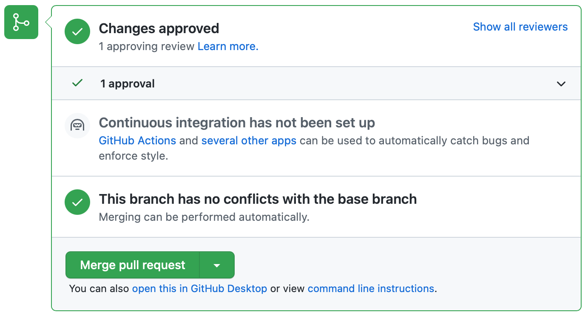

# Faire une *pull request*
{: .no_toc }

Lors de la [partie précédente](../branches/merge), nous avons vu comment fusionner des branches. Une **pull request**[^1] permet à quelqu’un de **demander** à ce qu’une branche soit fusionnée à une autre. Cette demande s’affichera alors sur la page *Pull requests* de ton dépôt sur GitHub, et elle pourra être ensuite acceptée ou refusée.

[^1]: Pour information, la même fonctionnalité est appelée *merge request* sur GitLab.

<figure>
  
  <figcaption>Illustration par <a href="https://storyset.com" target="_blank">Storyset</a>.</figcaption>
</figure>

## Table des matières
{: .no_toc.text-delta }
1. TOC
{:toc}

## Les *pull requests* : pourquoi ?

Cette fonctionnalité possède de nombreux avantages par rapport à une simple fusion :

* En règle générale, **tout le monde peut créer une *pull request***, même les gens qui n’ont pas la permission de modifier le dépôt.

  <header>Note</header>
  

    La plupart des logiciels dits <em>open source</em> sont développés de cette manière : tout le monde peut voir le code source, mais seul un petit nombre de personnes de confiance peut modifier le dépôt lui-même. Par contre, il est possible de proposer des modifications en créant une <em>pull request</em> qui pourra être acceptée par l’équipe du projet. Cela permet d’accepter des contributions des quatre coins du monde, en évitant les problèmes qui pourraient apparaître si n’importe qui pouvait modifier le dépôt quand bon lui semble.
  

* Chaque *pull request* a un espace de discussion pour pouvoir parler de leur avancement. On peut demander à quelqu’un de relire notre *pull request*, qui pourra alors proposer des modifications ou donner son approbation.
* Ce système offre une meilleure traçabilité des modifications effectuées sur le projet et de leur cheminement. Pour cette raison, il peut être utile d’utiliser les *pull requests* même sur des projets en solo.

## Créer une *pull request*

### Pour démarrer…
Tu peux débuter une *pull request* de ces deux manières :

* **Depuis GitHub Desktop**
   Si tu es en train de travailler avec GitHub Desktop, et que la branche que tu veux fusionner a bien entendu déjà été publiée sur GitHub, alors il te suffit de cliquer sur le bouton *Create Pull Request* qui s’affiche sur l’écran principal[^2].
  

[^2]: Au cas où tu aurais des modifications qui n’ont pas encore été commit dans ton projet, tu peux retrouver le même bouton dans le menu *Branch* de GitHub Desktop.

* **Depuis GitHub.com**
   Rends-toi sur la page de ton projet, puis dans l’onglet *Pull requests*, et clique sur le bouton *New pull request*. Sélectionne ensuite les deux branches concernées : la branche de *base* est celle qui va être *modifiée* (la plupart du temps, ce sera ta branche principale) ; l’autre branche est celle d’où proviennent les modifications. Clique ensuite sur **Create pull request**.
  

  <header>Astuce</header>
  

    Lorsque tu publies une nouvelle branche sur le dépôt distant, GitHub affiche un haut de la page du dépôt un lien direct vers la création d’une nouvelle <em>pull request</em> pour cette branche.
  

  

### Remplir les détails
Ensuite, tu peux remplir les détails de la *pull request* que tu es en train de créer. Le plus important est de mettre un **titre** qui décrit brièvement les changements, et éventuellement une **description** qui peut contenir plus de détails.

Dans la colonne de droite, en-dessous de **Reviewers**, tu peux demander à quelqu’un (par exemple ton binôme) de relire ta *pull request*.

Une fois que tout est prêt, clique sur **Create pull request**.

## Relire une *pull request*
OK, maintenant changeons de rôle : on va entrer dans la peau de la personne qui relit la *pull request*.

  <header>Astuce</header>
  
Pour la plupart des <em>pull requests</em> modifiant du code, tu auras besoin d’importer le code modifié dans ton éditeur de code local pour tester les changements. Tu peux le faire très simplement en cliquant sur le bouton vert <strong>Code</strong> en haut à droite de la page, puis en cliquant sur <strong>Checkout with GitHub Desktop</strong>.

Lorsque tu te rens dans l’onglet *Files changed* sur la page de la *pull request*, tu vois la liste des modifications qui ont été apportées.

Si tu aimerais apporter une suggestion à un endroit du code, tu peux cliquer sur le bouton **« + »** qui apparaît lorsque tu survoles une ligne de code. Écris ensuite ton commentaire, puis clique ensuite sur le bouton **Start review** (ou **Add review comment**) pour l’ajouter à tes retours.

  <header>Conseil de pro</header>
  
Lorsque tu rédiges un commentaire, tu peux appuyer sur le bouton <strong>Insert a suggestion</strong> pour proposer une modification spécifique du code. La modification proposée s’affichera clairement, et il sera même possible de l’appliquer en un clic sur le bouton <em>Commit suggestion</em> !

  

## Appliquer une *pull request*
Quand la *pull request* est prête, un encart situé en bas de l’onglet *Conversation* te permet d’effectuer le transfert des modifications entre les branches.

Clique sur le bouton vert (par défaut **Merge pull request**), puis sur le bouton de confirmation. Et voilà, la *pull request* a été appliquée !

  <header>Modes de fusion</header>

  
Le mode de fusion sélectionné par défaut est <em>Create a merge commit</em>, mais tu peux choisir parmi les trois options suivantes en cliquant sur le bouton <strong>« ▼ »</strong> à droite du bouton vert :

  <ul>
    <li><strong>Create a merge commit</strong> : crée un commit de fusion (comme nous l’avons fait dans la <a href="../branches/merge">partie précédente</a>).</li>
    <li><strong>Squash and merge</strong> : crée un commit sur la branche de base contenant toutes les modifications.</li>
    <li><strong>Rebase and merge</strong> : réapplique les commits sur la branche de base, comme s’ils y avaient été effectués.</li>
  </ul>

  

## Notes de bas de page
