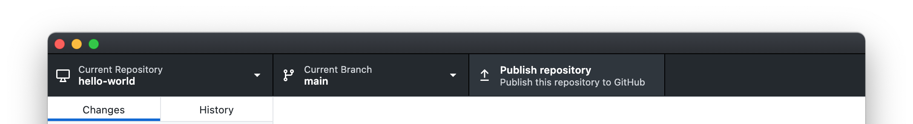
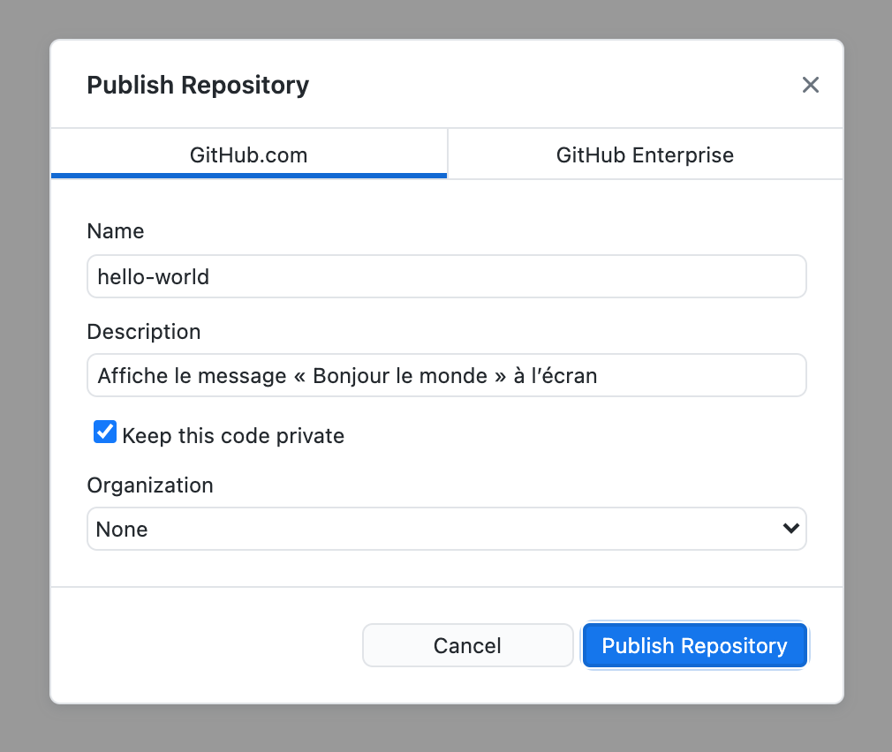
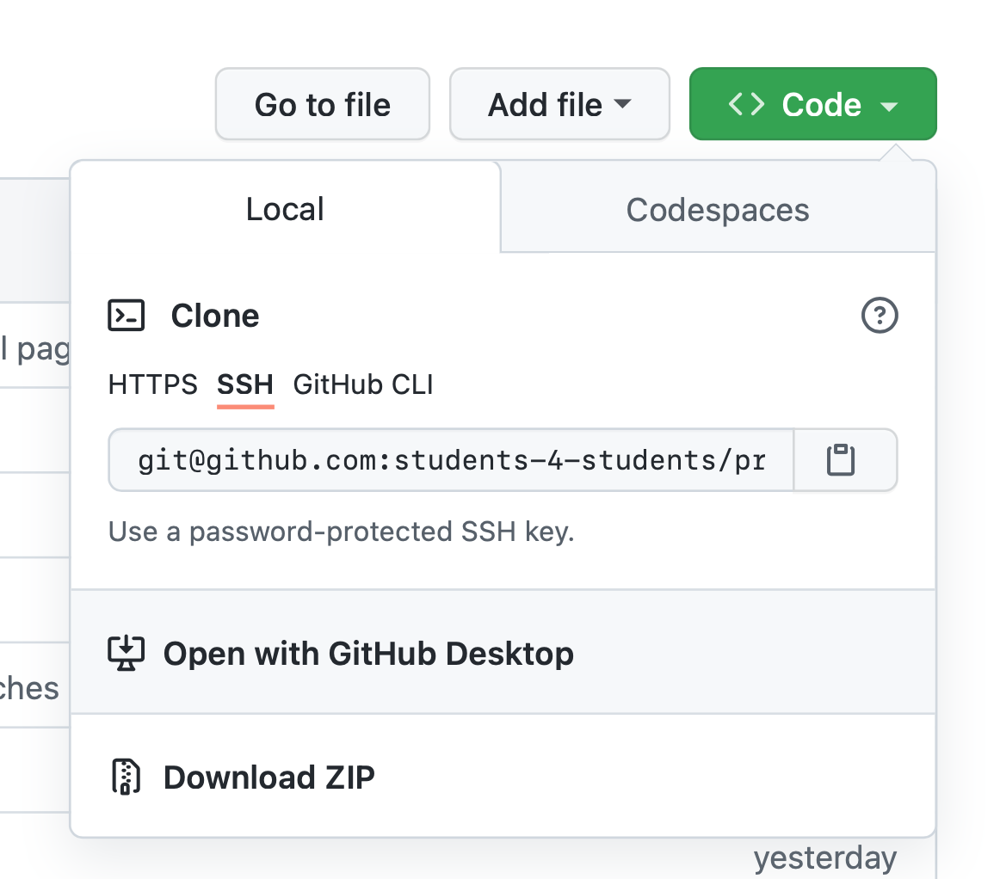
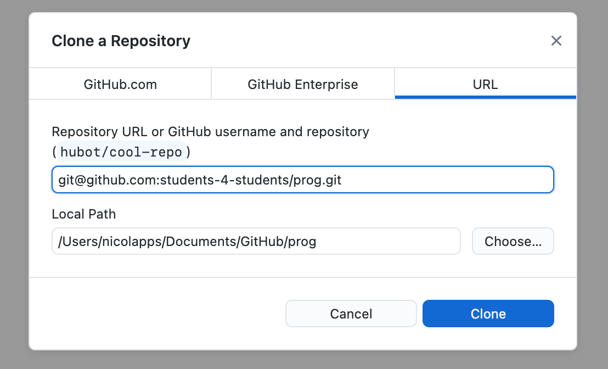

# Lier les dépôts local et distant
{: .no_toc }
Dans cette partie, nous allons voir comment publier sur GitHub un dépôt local (c’est-à-dire sur ton ordinateur), ainsi que comment télécharger localement un dépôt sur GitHub.

<figure>
  
  <figcaption>Illustration par <a href="https://storyset.com" target="_blank">Storyset</a>.</figcaption>
</figure>

## Table des matières
{: .no_toc.text-delta }
1. TOC
{:toc}

## Publier un dépôt <small>(dépôt local → dépôt distant)</small>
Mettre sur GitHub un dépôt que tu as créé sur ton ordinateur se fait très simplement. Tout d’abord, clique sur le bouton **Publish repository** dans la barre du haut de GitHub Desktop.

Ensuite, une fenêtre va s’ouvrir pour spécifier les détails :

* **Name** : C’est le nom que prendra ton dépôt sur GitHub.
* **Description** : Tu peux ici décrire brièvement le contenu du projet.
* **Keep this code private** : Si tu coches cette case, le projet ne sera visible que pour les personnes que tu as choisies. Il faudra donc la cocher pour tes mini-projets de semestre, qui pour empêcher la triche doivent obligatoirement être privés ! Si tu ne la coches pas, le projet sera public et tout le monde pourra le voir.

  <header>Astuce</header>
  
Tu peux donner à une autre personne les accès à un dépôt privé comme ceci :

  <ul>
    <li>Rends-toi sur la page web du dépôt sur GitHub.</li>
    <li>Ouvre l’onglet <em>Settings</em>, puis clique sur <em>Manage access</em>.</li>
    <li>Tu peux alors cliquer sur <em>Invite teams or people</em> et spécifier le compte GitHub que tu invites, ainsi que les permissions que tu veux lui accorder.</li>
  </ul>

* **Organization** : Une organisation est un « groupe » dans lequel tu peux mettre plusieurs dépôts (qui apparaîtront comme appartenant à l’organisation au lieu d’une personne). C’est notamment utile pour les entreprises et associations (par exemple, Students 4 Students a une <a href="https://github.com/students-4-students/" target="_blank">organisation GitHub</a> !). Pour tes projets personnels, tu peux laisser sur **None**.

Une fois ces détails réglés, tu n’as plus qu’à cliquer sur **Publish Repository**. Après quelques secondes, le tour est joué !

N’hésite pas tester tout cela maintenant avec le dépôt que tu as créé [dans la partie 3](../git-intro/init), c’est un bon exercice.

## Cloner un dépôt <small>(dépôt distant → dépôt local)</small>
Qu’est-ce qui se passe maintenant si tu es dans la situation inverse (tu as un dépôt sur GitHub que tu aimerais avoir sur ton ordinateur) ? Cette opération s’appelle est appelée **clonage**.

Tu peux cloner un dépôt en cliquant sur le bouton vert **Code** en haut à droite. Ensuite, clique simplement sur le bouton *Open with GitHub Desktop*. Tu peux ensuite spécifier à quel emplacement le projet doit être cloné, puis tu n’auras plus qu’à confirmer avec le bouton *Clone* de la fenêtre modale qui s’affiche.

  <header>Note</header>
  
Tu auras peut-être remarqué que GitHub propose aussi un bouton <em>Download ZIP</em>. Cependant, ce téléchargement ne comprend que les fichiers stockés dans le dépôt, mais pas les autres informations du dépôt lui-même (comme par exemple l’historique des commits). C’est donc plus pratique de faire un vrai clone dans la plupart des cas.

  <header>Astuce</header>

  
Il est également possible de cloner des dépôts stockés sur un autre service depuis GitHub Desktop, en allant dans le menu <em>File</em> puis <em>Clone Repository…</em>. Sélectionne ensuite l’onglet <em>URL</em>, puis copie dans le premier champ de texte l’URL du dépôt.

  

