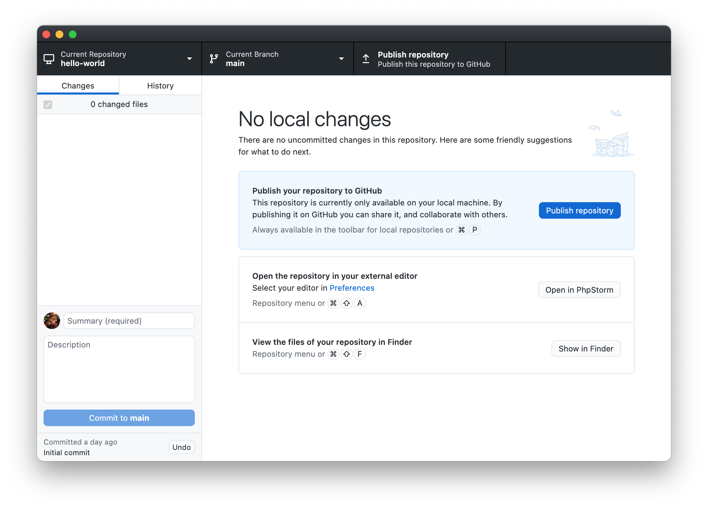
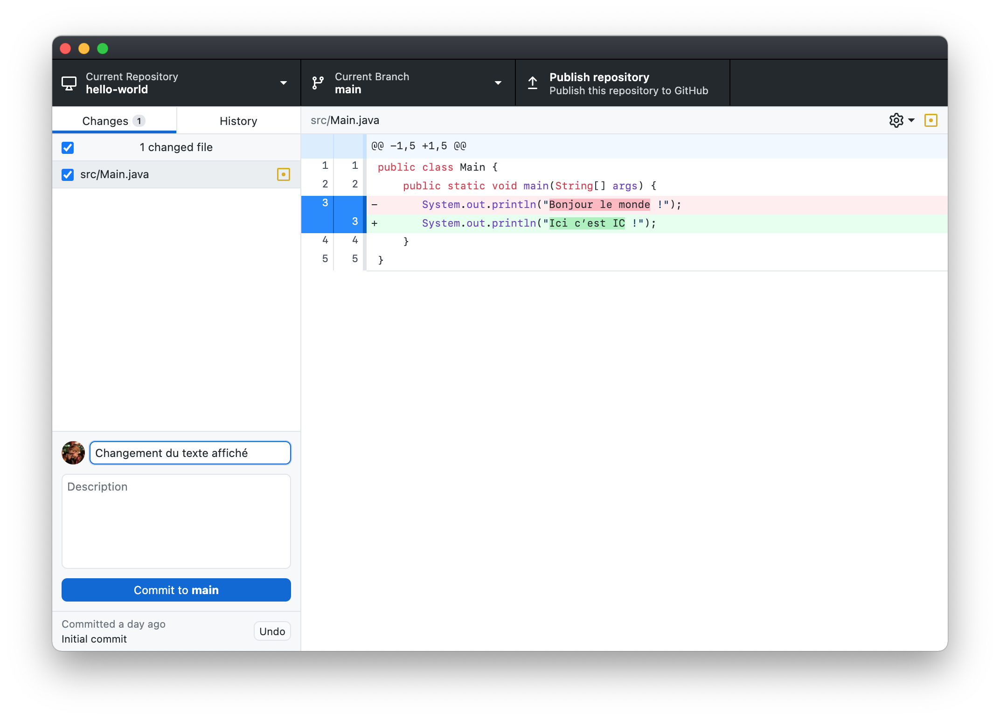

# Effectuer un commit
Maintenant, on va s’attaquer à la fonctionnalité la plus importante de Git : les commits.

## Qu’est-ce qu’un commit ?
Un commit peut être vu comme une modification particulière d’un projet[^1]. Il porte un nom descriptif et est associé au nom et à l’adresse e-mail de la personne qui l’a créé.

[^1]: Techniquement, un commit [est plutôt un *snapshot*](https://github.blog/2020-12-17-commits-are-snapshots-not-diffs/), c’est-à-dire une copie du projet au moment où le commit a été effectué, qui est enregistré de manière optimisée pour éviter de stocker plusieurs fois les mêmes informations. Cela te permet notamment de revenir à n’importe quel point de l’historique très rapidement. Cela dit, visualiser un commit comme étant une modification est très pratique pour comprendre comment utiliser Git, et ne pose pas de problème tant que tu ne dois pas travailler de près avec son fonctionnement interne.

Il n’y a pas de règle absolue sur quand tu dois en créer un, mais en règle générale c’est une bonne idée de le faire lorsque tu as effectué une modification complète (par exemple : l’ajout d’une partie de fonctionnalité, une correction de bug ou de faute d’orthographe…). Le principe suivant peut être utile :
> Si tu arrives à décrire simplement la modification que tu viens d’effectuer, alors c’est un bon moment pour faire un commit.

## Effectuer un commit
Lorsque tu as initialisé ton dépôt, GitHub Desktop a automatiquement effectué un commit nommé *“Initial commit”* contenant tous les fichiers qui étaient dans ton projet. Pour cette raison, il est indiqué *“No local changes”*, ce qui signifie qu’aucune modification n’a effectuée depuis le dernier commit.

Nous allons maintenant faire une modification dans le projet, puis créer un commit qui la contiendra.

* Rends-toi dans IntelliJ IDEA et modifie ton projet. Tu peux par exemple changer le texte qui s’affiche lorsque tu lances le programme. N’oublie pas d’enregistrer le fichier !
* Dans GitHub Desktop, les fichiers que tu as modifiés s’affichent dans la colonne de gauche. Tu peux décocher des fichiers pour ne pas les inclure dans le commit que tu t’apprêtes à faire.

* À droite s’affichent les modifications que tu as effectuées dans le fichier sélectionné dans la colonne de gauche. Si tu le veux, tu peux aussi désélectionner des lignes individuelles en cliquant sur les marqueurs bleus à leur gauche.

  <header>Bon à savoir</header>
  

    Pouvoir sélectionner précisément quels fichiers ou quelles lignes font partie de ton commit peut être pratique dans certains cas. Par exemple, si tu viens de faire deux modifications complètement indépendantes, c’est plus propre d’en faire deux commits séparés. Tu pourras alors désélectionner les fichiers ou lignes qui ne font pas partie du premier commit.
  

* Si tu veux complètement annuler un changement que tu n’as pas encore commit, tu peux faire un clic droit sur un fichier (ou une ligne de code) et sélectionner *Discard Changes…* (ou *Discard Selected Line(s)*).

* Tu peux maintenant décrire brièvement tes modifications dans le champ de texte en bas à droite. Si tu as besoin de plus de place, tu peux aller plus en détails dans la zone *« Description »*.

* Une fois que tout est prêt, clique sur le bouton **Commit to main**.

Et voilà, tu as effectué ton premier commit !

## Notes de bas de page
