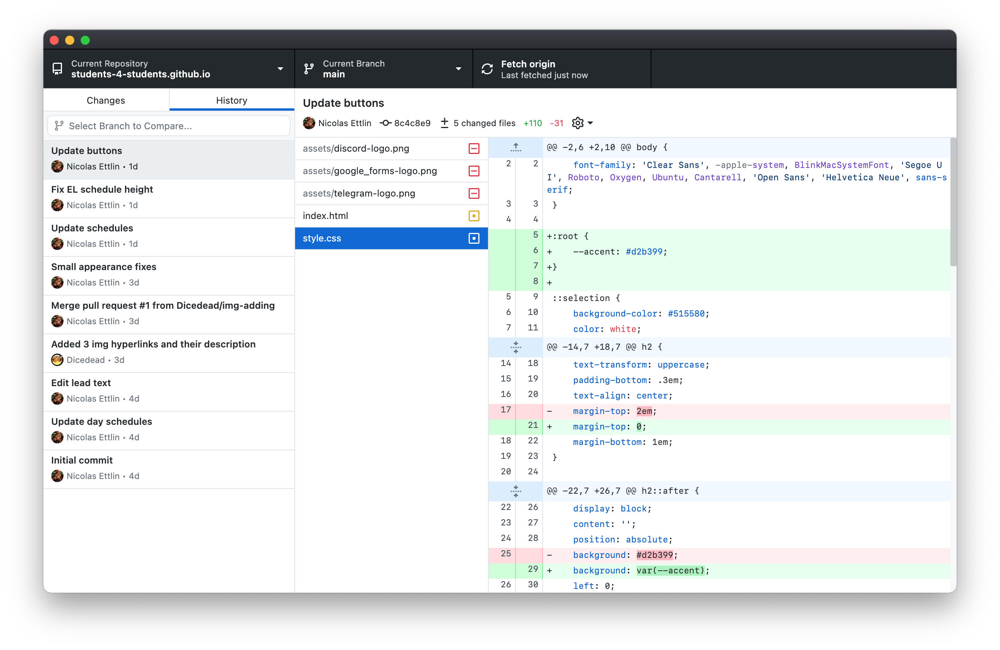
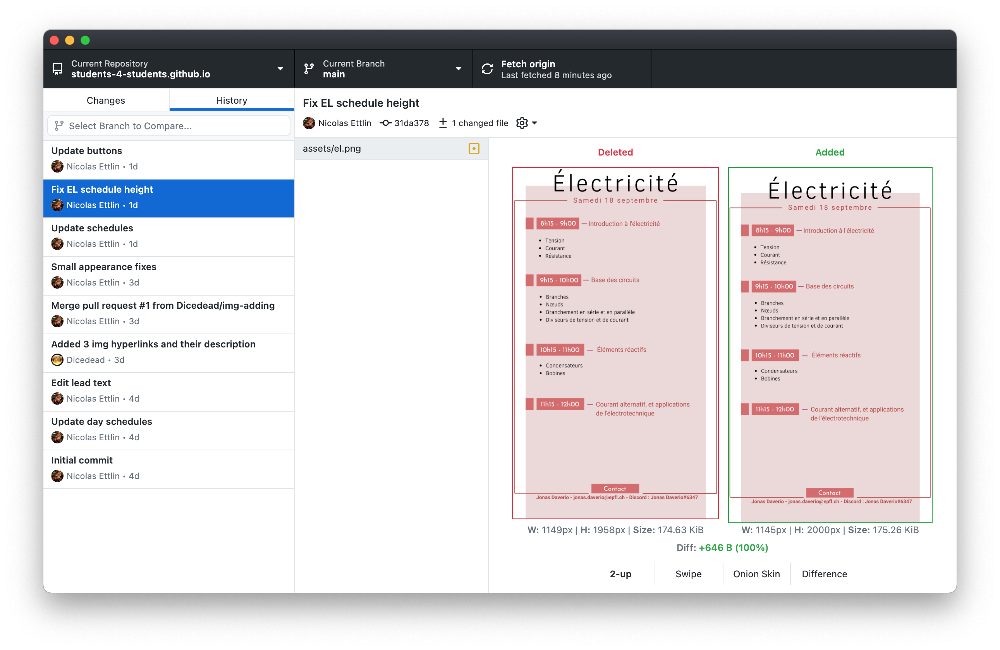

# Visualiser l’historique
Quelque chose de très pratique avec Git est la possibilité de voir toutes les modifications qui ont été faites sur un projet par le passé.

GitHub Desktop te permet de visualiser cela dans un écran dédié. Pour l’ouvrir, clique sur **History** en haut à gauche.

À gauche se situe la liste des derniers commits. Lorsque tu en sélectionnes un, les modifications effectuées lors de ce commit s’affichent sur la droite de la fenêtre.

Lorsque tu sélectionnes un fichier modifié contenant du code les lignes ajoutées s’affichent en vert, et celles qui ont été supprimées sont en rouge. Et lorsque tu sélectionnes une image, GitHub Desktop affiche une vue permettant de voir visuellement les différences.

