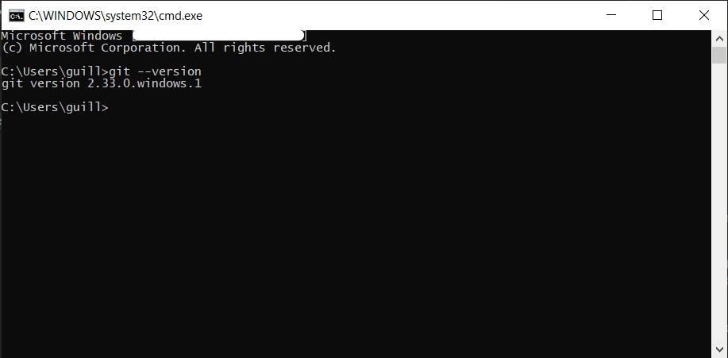

# Installer Git

## Pourquoi Git ?

**Git** est un outil sous *ligne de commande*. Il est plus compliqué à prendre en main que **GitHub desktop**. Alors pourquoi choisir **Git** et non **GitHub desktop** ? 

Tout d'abord l'usage du *Terminal* est incontournable en tant que développer. Vous familiariser avec est très important car dans certain cas vous n'avez que lui (*ssh*) ! La *learning-curve* est dans un premier temps décourageantes (toujours sur internet pour se rappeler des commandes) néanmoins petit à petit elles deviennnents un automatisme et vous n'y pensé même plus.

Secondo, l'usage du *Terminal* est bien plus rapide que celui de n'importe quelle *UI* car vos doigts ne sortent pas de votre clavier. 


## Installation
Choisissez votre liens de téléchargement
 * [windows](https://git-scm.com/download/win)

<div class="warning indent">
  <header>Attention</header>
  <p>
    Sur Windows vous ne devez pas oublier d'ajouter git au terminal. Pour ce faire simplement sélectionner l'option correspondant lors de l'installation

    
  </p>
</div>

 * [linux / unix](https://git-scm.com/download/linux)
 * [mac](https://git-scm.com/download/mac)

## Vérification de l'installation
Ouvrez une instance du terminal 

### Windows
Ouvrez le terminal en appuyant sur `Win+R` et en entrant `cmd` puis entrez les lignes suivantes :

```bat
git --version
```

Vous devriez voir quelque chose semblable à :


<div class="error indent">
  <header>Erreur</header>
  <p>
    Si une erreur est affiché du type
    <pre>'git' is not recognized as an internal or external command,
operable program or batch file.</pre>
    je vous conseil de vous référez à <a href="https://stackoverflow.com/questions/4492979/git-is-not-recognized-as-an-internal-or-external-command" >ce post</a> de stack-overflow
  </p>
</div>

### Linux / Unix / Mac OS
Ouvrez un terminal (en cherchant dans toutes les applications) et entrez

```bat
git --version
```

Si aucune erreur ne se produit, féliciation **Git** est installé