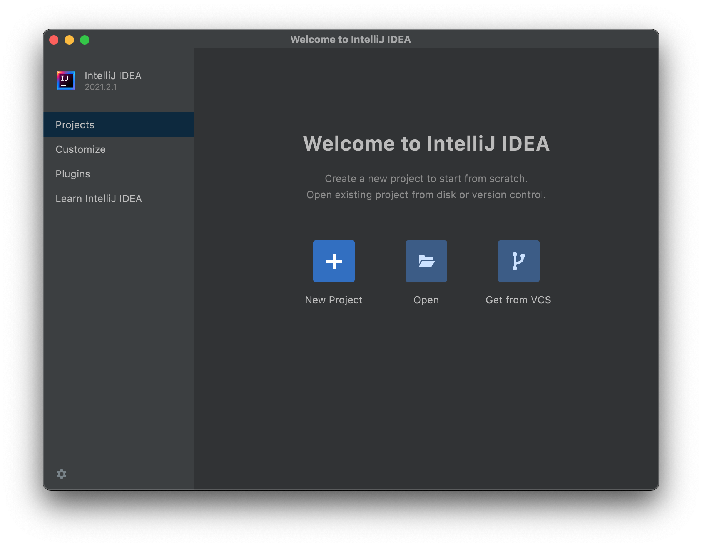

# Installer IntelliJ IDEA
{: .no_toc }

IntelliJ IDEA est un éditeur de code très puissant édité par la société JetBrains. Il est excellent pour travailler avec le langage Java, avec lequel tu travailleras en 1re année dans la section *Informatique* ou *Systèmes de communication*.

On dit parfoit d’IntelliJ IDEA que c’est un IDE (de l’anglais *integrated development environment*). Cela signifie qu’il propose de nombreuses fonctionnalités en plus de l’édition de code, comme un compilateur (qui permet de préparer ton code pour l’exécuter) et un débogueur (un outil qui aide à trouver les bugs dans tes programmes).

  <header>IntelliJ IDEA vs Eclipse</header>
  

    Un autre IDE répandu à l’EPFL pour le Java est <a href="https://www.eclipse.org">Eclipse</a>, qui est notamment utilisé par les cours de programmation du 1er semestre.
  

  

    Cependant, IntelliJ IDEA peut le remplacer dans tous les cas, tout en étant plus puissant et facile d’utilisation. Nous te recommandons donc de l’utiliser dès le début.
  

## Table des matières
{: .no_toc }
1. TOC
{:toc}

## Quelle édition utiliser ?

Il existe plusieurs versions d’IntelliJ IDEA. Les principales sont *IntelliJ IDEA Community Edition*, qui est gratuite et open source, et *IntelliJ IDEA Ultimate*, qui est payante et propose plus de fonctionnalités. Cependant, tu peux généralement te passer des fonctionnalités de la version *Ultimate* dans les tâches que tu effectueras [^1].

[^1]: Les fonctionnalités offertes en plus dans la version *Ultimate* sont principalement des outils permettant de travailler avec certaines technologies comme des frameworks, d’autres langages de programmation, et des bases de données. Des outils dits de *profilage* sont également proposés, te permettant de mesurer précisément la mémoire et le temps utilisés par ton code. Un comparatif détaillé est disponible sur [la page de téléchargement](https://www.jetbrains.com/idea/download/).

  <header>Recommandation</header>
  
Si tu es en <em>Informatique</em> ou en <em>Systèmes de communications</em>, suis les instructions pour <strong><a href="#idea-ce">installer IntelliJ IDEA Community Edition</a></strong>.

Si tu n’es pas en faculté IC, il existe également des versions d’IntelliJ IDEA prévues pour travailler avec d’autres langages de programmation. Voici un résumé de quel éditeur tu peux utiliser selon ta section :

<table>
  <tr>
    <th>Éditeur</th>
    <th>Langages</th>
    <th>Sections</th>
  </tr>

  <tr>
    <td>
      <strong>
        <a href="#idea-ce">IntelliJ IDEA</a>
      </strong>
    </td>
    <td>Java, Scala, Kotlin</td>
    <td>
      <abbr title="Informatique">IN</abbr>,
      <abbr title="Systèmes de communication">SC</abbr>
    </td>
  </tr>

  <tr>
    <td>
      <strong>
        <a href="#idea-edu">PyCharm</a>
      </strong>
    </td>
    <td>Python</td>
    <td>
      <abbr title="Chimie et génie chimique">CGC</abbr>,
      <abbr title="Génie civil">GC</abbr>,
      <abbr title="Science et génie des matériaux">MX</abbr>,
      <abbr title="Science et ingénierie de l’environnement">SIE</abbr>,
      <abbr title="Cours de mathématiques spéciales">CMS</abbr>
    </td>
  </tr>

  <tr>
    <td rowspan="2">
      <strong>
        <a href="#idea-edu">CLion</a>
      </strong>
    </td>
    <td>C++</td>
    <td>
      <abbr title="Ingénierie des sciences du vivant">SV</abbr>,
      <abbr title="Mathématiques">MA</abbr>,
      <abbr title="Physique">PH</abbr>,
      <abbr title="Microtechnique">MT</abbr>,
      <abbr title="Génie électrique et électronique">EL</abbr>
    </td>
  </tr>

  <tr>
    <td>C</td>
    <td>
      <abbr title="Génie mécanique">GM</abbr>
    </td>
  </tr>
</table>

## Installation

### Installer IntelliJ IDEA Community Edition <small>(recommandé)</small>

* Commence par te rendre sur <a href="https://www.jetbrains.com/idea/download" target="_blank">jetbrains.com/idea/download</a>.
* En dessous de **Community**, clique sur le bouton **Download** noir.

  <header>Conseil</header>
  

    Ce téléchargement peut prendre du temps. N’hésite pas à commencer la partie <em><a href="github-desktop" target="_blank">Installer GitHub Desktop</a></em> en attendant qu’il se termine.
  

* Ensuite, selon ton système d’exploitation :
  * **Sous Windows** : Ouvre le ficher *.exe* téléchargé, et suis les instructions de l’assistant d’installation. Tu peux laisser tous les réglages par défaut. À la fin, coche la case *Run IntelliJ IDEA Community Edition*.
  * **Sous macOS** : Ouvre le fichier *.dmg* téléchargé. Dans la fenêtre qui s’ouvre, glisse l’icône *IntelliJ IDEA CE* sur l’icône *Applications*. Ensuite, ferme la fenêtre, puis ouvre *IntelliJ IDEA CE* depuis le dossier *Applications* de ton Mac.
  * **Sous Linux** : Décompresse l’archive *.tar.gz* téléchargée, puis suis les instructions dans le fichier *Install-Linux-tar.txt*.
* Une fois que tu as l’écran **“Welcome to IntelliJ IDEA”**, l’installation est terminée !

### Installer une licence éducation pour IntelliJ IDEA Ultimate, PyCharm ou CLion <small>(facultatif)</small>

@TODO

## Notes de bas de page
