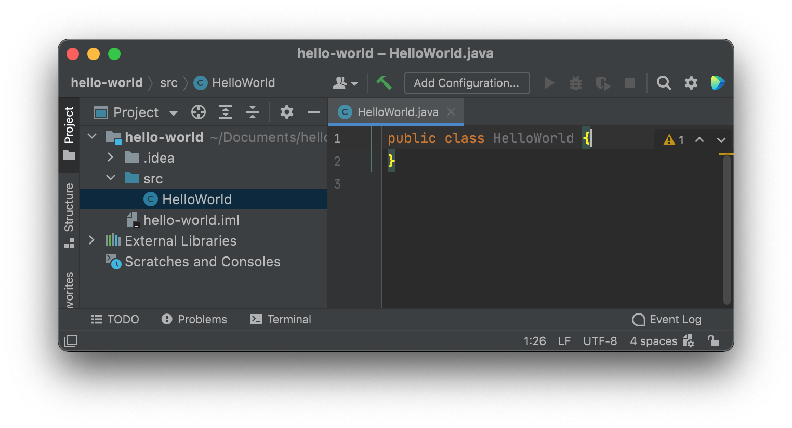
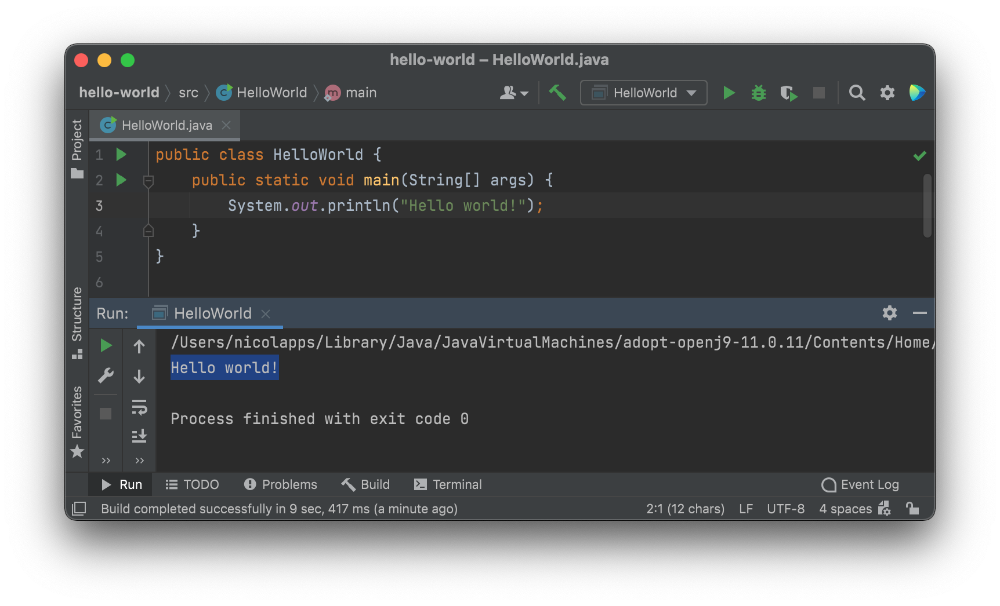

# Créer un programme en Java

Maintenent que le projet a été configuré et que tu as eu un aperçu des fonctionnalités d'IntelliJ, il est temps de réaliser ton premier programme en Java.

## Créer un fichier sur IntelliJ
Comme expliqué précédemment, ton code doit se trouver dans le dossier ***src***. Nous allons donc ajouter un fichier à ce dossier. Pour cela, fait un clique droit sur *src* dans le *gestionnaire de projet* et sélectionne *New*>*Java Class*. Donne lui le nom **"HelloWorld"**.



IntelliJ génère automatiquement l'entête de la classe comme ci-dessus. Il ne reste plus qu'à écrire notre code.

## Coder or not coder
Le plus incroyable lorsqu'on utilise un IDE comme IntelliJ, ce sont les **suggestions** et **l'autocomplétion**. Avec de simples astuces, tu vas être en mesure de coder deux fois plus vite que toute ta promo ! Pour réaliser le programme qui doit afficher "Hello World !" et observer la puissance d'IntelliJ, voyons deux méthodes pour écrire le même code.

#### 1 ) Coder mot par mot :
* Entre les crochets de la classe - le conteneur de ton programme -, insère la fonction `main` suivante :
```
public static void main(String[] args) {
}
```
C'est le point d'entrée de ton programme, la première fonction qui sera exécutée. Tu découvriras plus tard la raison de sa syntaxe si particulière...

* Pour pouvoir afficher le message "Hello World !" dans la console, il faut faire appel à la méthode `print` de Java (encore une fois, sa syntaxe peut paraître étrange mais pour le moment nous ne rentrerons pas dans les détails) :
```
public static void main(String[] args) {
      System.out.println("Hello World !");
}
```
Voilà ! Il n'y a rien de plus à écrire ! Mais si comme tous les infos tu es un flemmard, c'est déjà trop ! Alors voici comment te simplifier la vie.

#### 2 ) Flemme de coder
Nous allons réaliser les mêmes étapes en ne tapant que sur 10 touches (hors "Hello World !"). Tu ne crois pas que c'est possible ? Essaie donc :

* Pour créer la fonction main, tape *`psvm`* puis appuie sur *Entrer*.
* Pour écrire la fonction `print`, tape *sout* puis appuie sur *Entrer*.
* Il ne te reste plus qu'à écrire le message à afficher !

Il existe de nombreux raccourcis comme ceux-ci, mais ces deux là te seront essentiels pour n'importe quel programme. N'hésite pas à découvrir d'autres raccourcis, ou à configurer toi même des *Live Templates* dans les réglages.


Ton programme est donc prêt à être exécuté, testons le dès à présent.

## Exécuter un programme

Si tu regardes bien dans le coin supérieur droit, tu peux trouver une sorte de bouton "play" grisé. Il ne sert pour le moment à rien puisqu'il faut configurer l'exécution avec *Add Configuration...* . Mais encore une fois, IntelliJ va tout faire à notre place.

* Clique  sur l'un des deux boutons "play" situés juste à la gauche de ton code puis *Run 'HelloWorld.main()'*. Cela va directement exécuter la fonction `main`.



Tu devrais normalement obtenir le résultat ci-dessus. Bravo ! Tu as conçu ton premier programme en Java !
