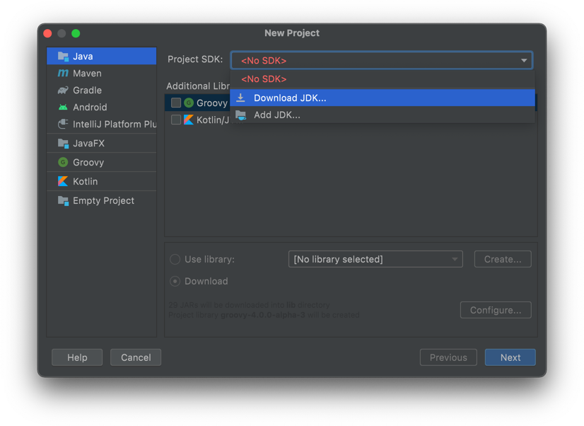
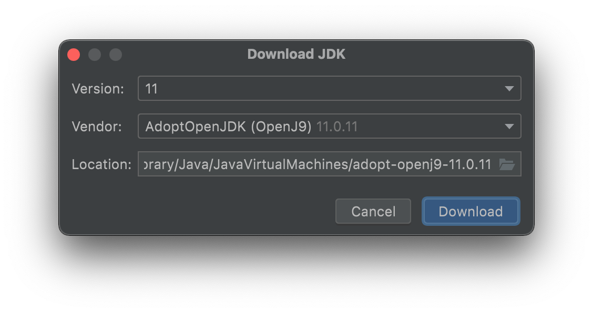
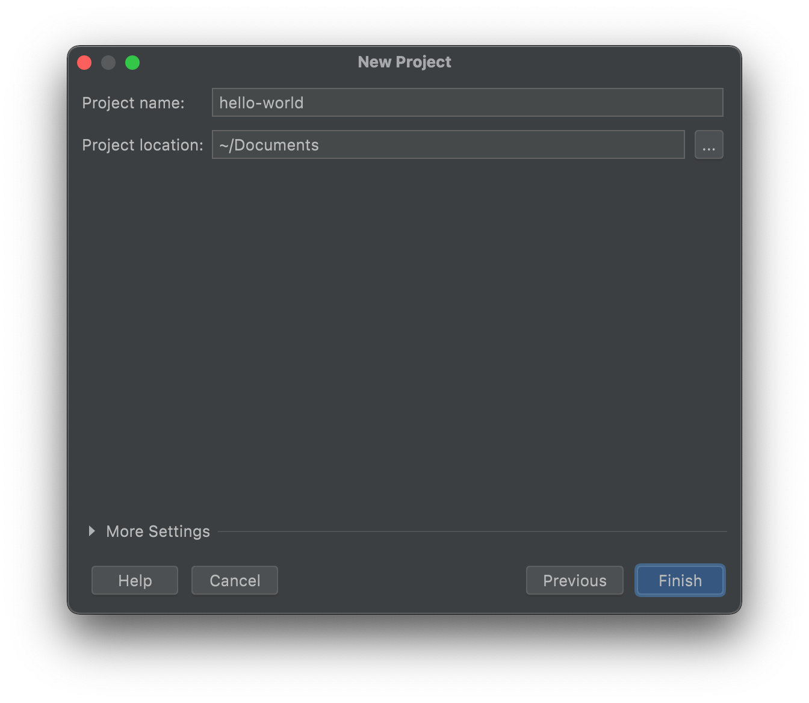

# Créer un projet

Commençons par ouvrir IntelliJ IDEA et créer le premier projet de programmation Java que tu réaliseras cette année. Le but de ce dernier sera simple : afficher sur la console la simple phrase « Hello world ». Il va cependant être nécessaire de préparer un peu le terrain avant de passer au code.

Pour pouvoir développer des applications en Java, tu vas devoir installer une version du **JDK** (*Java Development Kit*). C’est un ensemble de composants logiciels dont ton ordinateur aura besoin pour compiler et exécuter ton projet. IntelliJ IDEA peut télécharger et configurer le JDK à ta place, c’est ce que nous allons faire maintenant.

## Marche à suivre

* Depuis la fenêtre de démarrage d’IntelliJ IDEA, clique sur **New project**.

* Assure-toi que *Java* est sélectionné dans la colonne de gauche, puis sélectionne **Download JDK** dans le menu déroulant *Project SDK*.
  

* Une fenêtre d'options va apparaître. Sélectionne la **version 11** (c’est celle qui va être utilisée en cours), et **AdoptOpenJDK OpenJ9** sous *Vendor*. Tu n’as pas besoin de modifier le dossier d'installation. Clique ensuite sur **Download**.
  

* Une fois le JDK installé, sélectionne deux fois *Next* pour arriver à l’écran ci-dessous. Nous intitulerons le projet **hello-world**. Tu peux décider de créer le projet dans le dossier que tu souhaites avec *Project location*. Il n’est pas nécessaire de toucher les réglages dans la partie *More Settings*.

Et voilà ! Une fois que tu auras appuyé sur **Finish**, ton projet sera créé.
