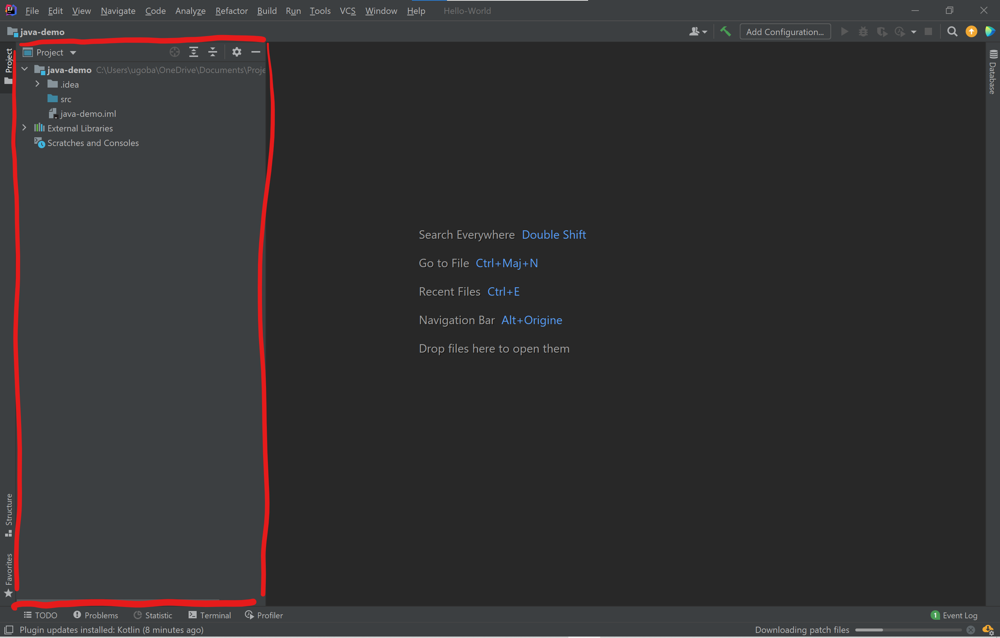
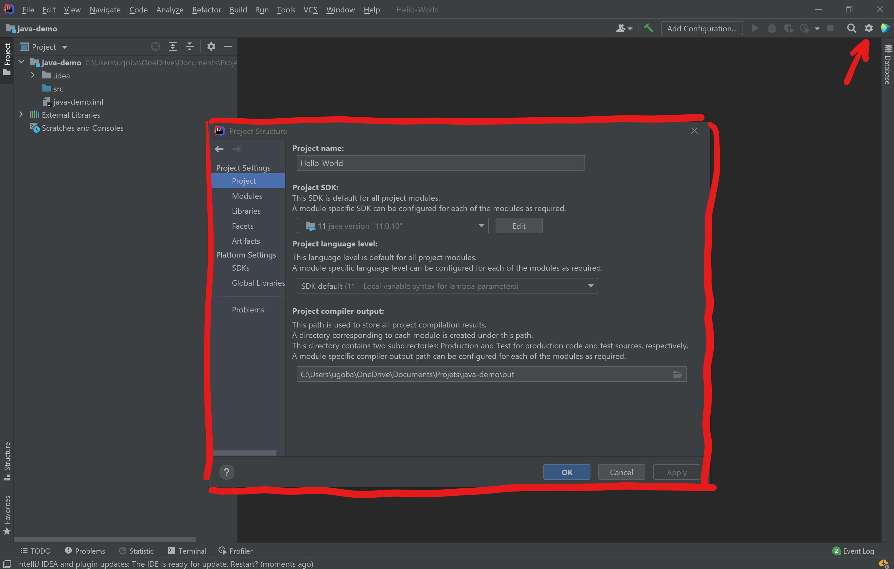
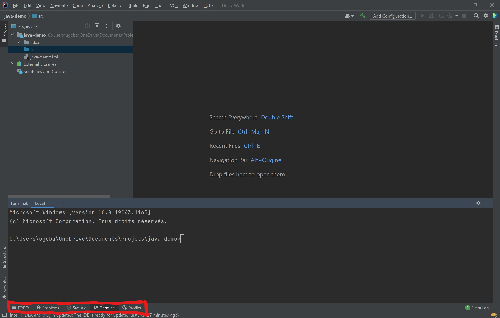

# Découvrir l’interface

IntelliJ est un logiciel qui te facilitera la vie, à condition que tu saches comment l'utiliser. Dans cette section, nous allons voir les différentes parties de l'interface qui te seront utiles.

## Gestionnaire de project

Le **gestionnaire de projet** regroupe l'ensemble des fichiers contenus dans le dossier du projet. Situé à droite, il te permettra de gérer les fichiers des différentes classes de ton programme (tu ne tarderas pas à découvrir ce concept). Tu pourras aussi y retrouver tous types de fichiers dont ton projet aura besoin (images, sons...).

  <header>Dossier *src*</header>
  

    Le dossier *src* est le dossier pricipal de ton projet. Par convention, il contient tout le code que tu écriras : c'est le dossier source. Pour ce qui est des autres fichiers comme les images ou sons, il est d'usage de les mettre dans un dossier *ressource* à part.
  

## Gérer les paramètres du projet

En cliquant sur l'engrenage en haut à droite, il est possible d'accéder à différentes fenêtres contextuelles de paramètres. Celle qui nous intéresse ici s'appelle *Project Structure*. Grâce à cette fenêtre, tu peux modifier le nom du projet ou le JDK qu'il utilise, mais aussi installer une bibliothèque java ou configurer un *Artifact*, un fichier de sortie pour le projet (zip ou jar, tu verras par la suite).

  <header>Libraries - Bibliothèques Java</header>
  

    En programmation, une bibliothèque ("Library" en anglais) est un ensemble de fonctions utilisables, regroupées et mises à disposition afin de pouvoir les utiliser sans avoir à les réécrire. Par exemple, une bibliothèque comme JavaFX permet de créer une interface graphique à l'aide des classes et fonctions qu'elle propose.
  

## Autres outils

Tout en bas de la fenêtre se trouvent des outils fort utiles :
* Le *Terminal* permet d'exécuter des lignes de commandes dans le dossier du projet.
* L'onglet *Run* affiche le résultat de ton programme, ce qu'il affiche.
* *Debug* permettra d'exécuter ton programme pas à pas lorsque tu chercheras un bug.
* *Problems* aussi est un outil de déboggage : il permet de voir l'ensemble des erreurs qui se sont immiscées dans le code.
* *TODO* peut être utilisé comme une checklist des tâches à réaliser, disséminées dans le code (les commentaires "//TODO").

Ces onglets ne sont pas tous visibles sur la photo d'illustration car ils apparaîssent au fur et à mesure de tes actions (si tu lances ton programme, l'onglet *Run* apparaît)
