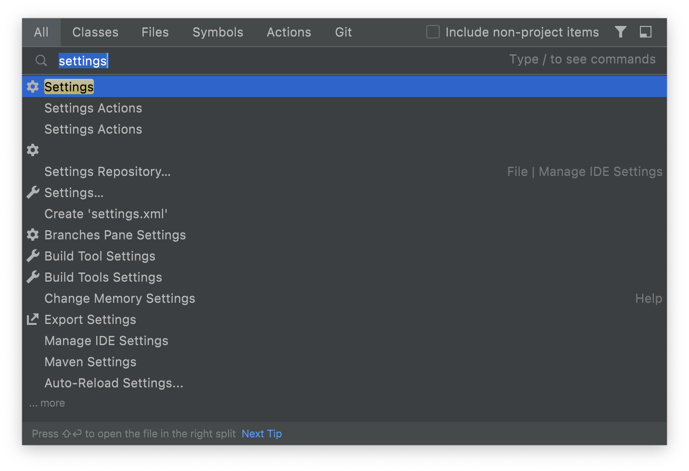
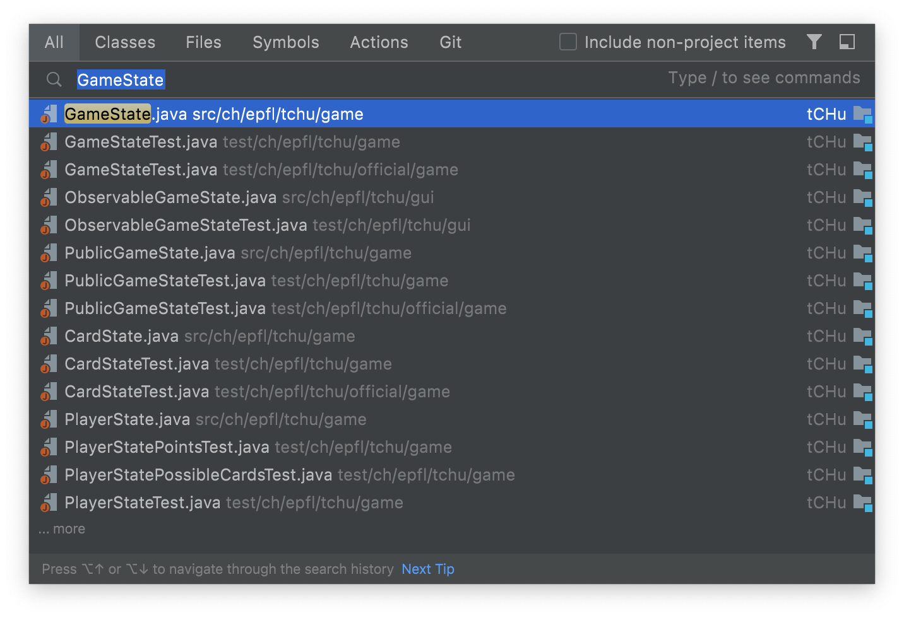

# Découvrir l’interface
{: .no_toc }

IntelliJ IDEA est un logiciel qui te facilitera la vie, à condition que tu saches comment l'utiliser. Dans cette section, nous allons voir les différentes parties de l'interface qui te seront utiles.

<hr>
## Table des matières
{: .no_toc.text-delta }
1. TOC
{:toc}
<hr>

## Palettes d’outils
Te voilà arrivé dans la fenêtre principale d’IntelliJ IDEA. Au centre se situera l’éditeur, une fois que tu auras ouvert un fichier. Sur les côtés peuvent se situer plusieurs **palettes d’outils**. Tu peux les faire apparaître en cliquant sur leurs noms sur le bord de la fenêtre.

Celles qui te sont les plus utiles sont :
* La vue ***Project*** (sur la gauche), qui affiche tous les fichiers de ton projet (code, images, sons…).
  
* Le **terminal** (en bas) permet d'exécuter des lignes de commandes dans le dossier du projet.
* L’onglet ***Run*** (en bas) affiche le résultat de ton programme, ce qu'il affiche. Note que cette palette ne s’affiche pas tant que tu n’as pas lancé de programme.
* **Problems** permet de voir l'ensemble des problèmes qu’IntelliJ IDEA détecte dans ton code. Cela peut être des erreurs (qui empêchent ton programme d’être lancé), ou des avertissements (des morceaux de code suspects qui peuvent causer un problème plus tard).
* La palette **TODO** peut être utilisé comme une liste de tâches à réaliser : cette palette répertorie les commentaires[^1] disséminés dans le code contenant le mot `TODO` (qui vient de *to do*, *à faire* en anglais).

[^1]: En programmation, un commentaire est une ligne dans le code qui est ignorée par l’ordinateur, et sert à donner des indications aux personnes qui lisent ton code. Par exemple, la première ligne de cet exemple est un commentaire :

    ```java
    // Affiche un message à l’écran
    System.out.println("Hello world.");
    ```

## Recherche globale
La recherche globale est un raccourci clavier très puissant dans IntelliJ IDEA. Elle te permet d’accéder rapidement à n’importe quelle commande ou fichier de ton projet.

Pour l’actionner, appuie deux fois sur la touche majuscule (⇧). Tu peux ensuite rechercher ce dont tu as besoin dans la fenêtre qui s’ouvre.

<figure>
  
  <figcaption>Exemple de recherche de fichier.</figcaption>
</figure>

<figure>
  
  <figcaption>Exemple de recherche de réglage.</figcaption>
</figure>

## Notes de bas de page

